# [JB Fit](https://ci-jb-fit-73ac55dce174.herokuapp.com/)

[](https://github.com/Jordan-Boulton1/peak-performance/commits/main)
[](https://github.com/Jordan-Boulton1/peak-performance/commits/main)
[](https://github.com/Jordan-Boulton1/peak-performance)

Welcome to JB Fit, your ultimate online personal fitness coaching app. JB-Fit is designed to revolutionize the way you approach fitness by providing personalized coaching, comprehensive exercise plans, and a supportive community all in one platform. Whether you're a fitness novice or a seasoned athlete, JB-Fit is here to help you achieve your fitness goals and unlock your peak performance.

### What can you expect?

JB Fit aims to create a centralized and seamless fitness experience that combines expert coaching, tailored exercise & nutrition plans, and a vibrant community. My goal is to make high-quality fitness coaching accessible and affordable to everyone.

### Who do I target?

JB Fit is designed for:

- **Fitness enthusiasts**: Individuals who are passionate about fitness and are looking for structured exercise plans and professional guidance to enhance their workout routines.
- **Beginners**: Those who are new to fitness and need a supportive environment, clear guidance, and easy-to-follow plans to start their journey.
- **Busy Professionals**: People with a hectic schedule who require flexible, personalized coaching that fits into their lifestyle.
- **Fitness Coaches**: Professional coaches who want to reach a wider audience and provide their services through an innovative online platform.

### What benefits do you get?

- **Personalized Coaching**: Receive one-on-one coaching from a fitness expert, tailored to your specific goals and needs. 
- **Personal Check-Ins**: Benefit from regular personal check-ins to ensure you're on track with your fitness goals and receive the support you need to succeed.
- **Custom Exercise Plans**: Get exercise plans specifically designed for you  by a fitness professional. These personalized plans take into account your current fitness level, goals, and preferences, ensuring maximum effectiveness and safety.
- **Tailored Nutrition Plans**: Access personalized nutrition plans that complements your fitness goals. These plans are crafted to meet you dietary preferences and nutritional needs, helping you achieve optimal results.
- **Community Support**: Join a thriving community of like-minded individuals who share your passion for fitness. Engage in forums, share your progress, and support each other.
- **Convenient Payments**: With integrated Stripe payments, purchasing exercise plans and booking coaching sessions is secure and hassle-free.
- **Progress Tracking**: Keep track of your fitness journey with tools to monitor your progress, set new goals, and celebrate your achievements.

JB Fit is more than just a fitness application—it's your partner in achieving a healthier, stronger, and more empowered version of yourself. Take the step towards reaching your peak performance with JB Fit.


source: [amiresponsive](https://ui.dev/amiresponsive?url=https://ci-jb-fit-73ac55dce174.herokuapp.com/)

## UX


When designing this webpage I wanted to achieve a simple, yet welcoming and professional feeling, creating a nice user experience.

### Colour Scheme

The colour scheme for the JB Fit website has been thoughtfully selected to create a visually appealing and effective user experience.

- `#FFFFFF` & `#000000` used interchangeably for primary text and headings.
- `#FF5100` used for primary highlights.
- `#f5f5f5` used as the  primary background colour.
- `#353431` used as the secondary background colour, primarily in the navbar and footer.

I used [coolors.co](https://coolors.co/ffffff-f5f5f5-ff8f5c-ff5100-353431-000000) to generate my colour palette.


I've used CSS `:root` variables to easily update the global colour scheme by changing only one value, instead of everywhere in the CSS file.

```css
:root {
--primary-color: #353431;
--primary-color-highlight: #FF5100;
--secondary-color-highlight: #FF8F5C;
/* Bootstrap overrides */
--bs-body-bg: #f5f5f5;
--bs-body-font-family: 'Cambay', sans-serif;
```

### Typography

- [Montserrat](https://fonts.google.com/specimen/Montserrat) was used for the primary headers and titles.

- [Mukta](https://fonts.google.com/specimen/Mukta) was used for the secondary headers and titles.

- [Cambay](https://fonts.google.com/specimen/Cambay) was used for all other secondary text.

- [Font Awesome](https://fontawesome.com) icons were used throughout the site, such as the social media icons in the footer.

## User Stories

### New Site Users

- As a **new user**, I want to **be able to create a new account with my personal information**, so that I **can start tracking my weight and physical measurements.**
- As a **new user**, I want to **read success stories and testimonials** so that **I can trust the effectiveness of the coaching services.**
- As a **new user**, I want to **be able to message the coach with any queries I have before purchasing a plan**, so that I **can make an informed decision.**
- As a **new user**, I want to **be able to access a comprehensive FAQ section**, so that I **can quickly find answers to common questions about the platform and its services without needing to contact support.**

### Registered Site Users

- As a **registered user**, I want to **update my profile information**, so that my **information remains accurate and relevant.**
- As a **registered user**, I want to **securely pay for my selected training package using Stripe**, so that I can **access my plans and coaching services.**
- As a **registered user**, I want to **contact my coach for support** so that I **can get help when I need it.**
- As a **registered user**, I want to **be able to reset my password if I forget it**, so that I **can regain access to my account securely.**
- As a **registered user**, I want to **receive a confirmation message after successfully purchasing a training plan**, so that I **know my payment was processed and I have access to the purchased plan.**
- As a **registered user**, I want to **be able to view my order history**, so that I **can keep track of the training plans or products I have purchased.**
- As a **registered user**, I want to **be able to see which training plans I have already purchased**, so that I **don’t accidentally buy the same plan again.**
- As a **registered user**, I want to **be able to view my weight progress on a graph**, so that I **can easily visualize my weight changes over time and assess my progress toward my goals.**
- As a **registered user**, I want to **delete a progress image**, so that I **can remove pictures that I no longer want to keep or that were uploaded by mistake.**
- As a **registered user**, I want to **see all my uploaded progress images**, so that I **can compare my current and past progress visually.**
- As a  **registered user**, I want to **be able to upload a progress image**, so that I **can visually track my progress over time.**
- As a **registered user**, I want to **view and purchase training plans** so that I **can select the plan that best fits my needs.**
- As a **registered user**, I want to **delete a weight log entry**, so that I **can remove any incorrect or unwanted entries from my history.**
- As a **new or registered user**, I want to **be able to subscribe to the newsletter**, so that I **can receive monthly updates about the latest news in the fitness world.**
- As a **registered user**, I want to **edit an existing weight log entry**, so that I **can correct any mistakes or update my records if my weight changes.**
- As a **registered user**, I want to **view my profile information and progress**, so that I **can monitor my weight changes and keep track of my goals.**
- As a **registered user**, I want to **see a list of all my weight logs**, so that I **can review my progress and make adjustments as needed.**
- As a **registered user**, I want to **be able to add a new weight log entry**, so that **I can track my progress over time.**
- As a **registered user**, I want to **delete my profile**, so that **my personal information is no longer stored in the system.**

### Site Admin

- As an **admin**, I want to **create, manage and update plans** so that **users can see the up-to-date plans and services at the current time**
- As an **admin**, I want to **view and manage the list of newsletter subscribers**, so that I **can effectively communicate with users and ensure the newsletter reaches the intended audience.**
- As an **admin**, I want to **integrate Stripe for handling payments** so that **users can pay for plans and make payments securely.**
- As an **admin**, I want to **be able to sort received messages from users by date and alphabetically**, so that **I can efficiently manage and review messages in a more organized manner.**

## Mock-ups

To follow best practice, mockups were developed for this project.
I've used [Figma](https://www.figma.com) to design my site mockups.

### Home Page Mock-ups

<details>
<summary> Click here to see the Home Page Mock-ups</summary>

#### Home
   - 

  - 

  - 

  - 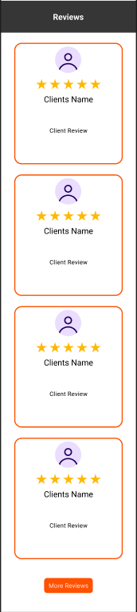

  - 

  - 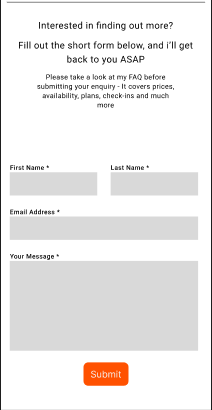

</details>

### About Page Mock-ups

<details>
<summary> Click here to see the About Page Mock-ups</summary>

#### About
  - 
  
  - 

  - 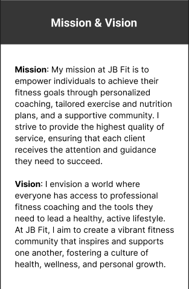

  - 

  - 

</details>

### Plans Page Mock-ups

<details>
<summary> Click here to see the Plans Page Mock-ups</summary>

#### Plans
  - 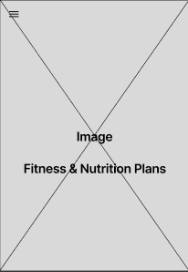

  - 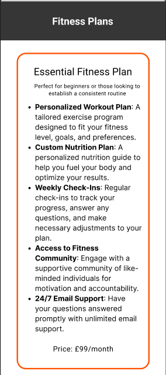

  - 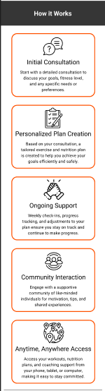

</details>

### FAQ Page Mock-ups

<details>
<summary> Click here to see the FAQ Page Mock-ups</summary>

#### FAQ
  - 

  - 

</details>

### Testimonials Page Mock-ups

<details>
<summary> Click here to see the Testimonials Page Mock-ups</summary>

#### Testimonials
  - 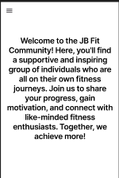

  - 

  - 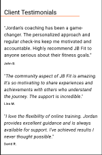

  - 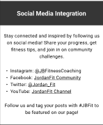

  - 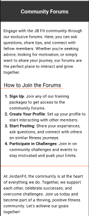

</details>

## Features

### Existing Features

#### Navigation Bar

- **Responsive Navigation Bar**

    - The site includes a fully responsive navigation bar that adapts to different screen sizes. On mobile devices, the navigation bar collapses into a toggleable menu, enhancing usability for users on the go. The navigation bar provides easy access to essential pages such as Home, About, Plans, FAQ, and Community, ensuring users can quickly navigate the site. For logged-in users, additional options like 'My Profile' and 'Logout' are available, making it easy to manage their account.

		
		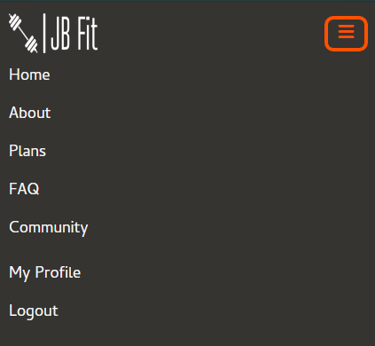

- **Custom Logo**

    - The website features a custom logo prominently displayed in the navigation bar, reinforcing brand identity. This visual element helps establish trust and recognition, as users can immediately identify the JB Fit brand. The logo is linked to the homepage, allowing users to return to the main page with a single click.

		

- **Authentication Links**

    - Depending on the user's authentication status, the navigation bar dynamically displays relevant options. For unauthenticated users, 'Login' and 'Register' links are provided, encouraging new sign-ups and making it easy for returning users to log in. Authenticated users are presented with 'My Profile' and 'Logout' options, enabling seamless account management.

		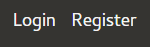
		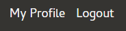

### Footer

- **Social Media Links**

    - The footer includes prominent social media links, allowing users to connect with JB Fit across multiple platforms like Facebook, Instagram, Twitter, LinkedIn, and YouTube. This integration helps build a community around the brand and keeps users engaged with the latest updates and content from JB Fit.

		

- **Newsletter Subscription Form**

	- The footer also includes a newsletter subscription form, which is a valuable tool for maintaining communication with users. By subscribing, users receive monthly updates on fitness trends, promotions, and news. This feature is crucial for user retention and driving ongoing engagement.

		

- **Quick Links Section**

	- A quick links section in the footer provides easy access to the most important pages on the site. This section is especially useful for users who may need to quickly navigate to another part of the site without returning to the top of the page.

		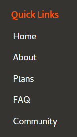

- **Custom Footer Branding**

	- The footer is customized to include JB Fit’s branding, including a copyright notice and branding colors. This consistent branding across the site enhances the professional appearance and reinforces the site’s identity.

		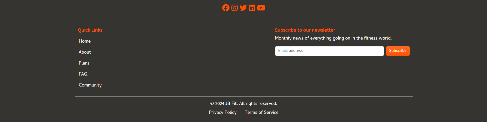

### Home Page

- **Hero**

    - The hero section is the first thing users see when they visit the website. It features a strong, compelling headline and a call-to-action button that encourages users to start their fitness journey. This section is visually impactful, with a background image that sets the tone for the site, and a clear value proposition that appeals to users looking for personal online fitness coaching.

		

- **About**

    - The About section introduces the site's founder, Jordan, providing credibility and a personal connection with visitors. It explains Jordan's experience and qualifications, which helps to build trust with potential clients. The section is accompanied by a professional image, further enhancing the personal connection with visitors.

		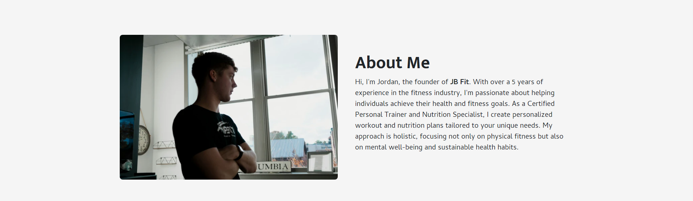

- **Online Personal Training**

    - This section explains what online personal training is and outlines its benefits, such as flexibility, personalization, accessibility, and affordability. It also includes visually appealing icons that represent each benefit, making it easy for users to understand the advantages of online training at a glance. This section is crucial for educating visitors about the unique value proposition of online training.

		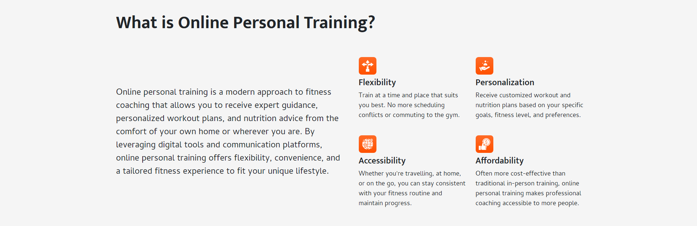

- **How It Works**

    - The "How It Works" section breaks down the process of getting started with JB Fit into four easy steps: Initial Consultation, Personalized Plan, Ongoing Support, and Community Interaction. Each step is visually represented with an icon and a brief description, helping users understand what to expect when they sign up. This transparency is key to converting visitors into clients.

		

- **Client Reviews**

    - The Client Reviews section features testimonials from satisfied clients, which are essential for building social proof. Each review is accompanied by a star rating and a photo of the client, making the testimonials more relatable and trustworthy. This section helps reassure potential clients of the quality and effectiveness of JB Fit’s services.

		

- **Training Plans**

    - The Training Plans section presents the different packages available, each with a clear breakdown of what’s included and the associated cost. This section is designed to help users easily compare the options and choose the one that best fits their needs. The use of distinct cards for each plan, along with prominent pricing, makes this information easy to digest.

		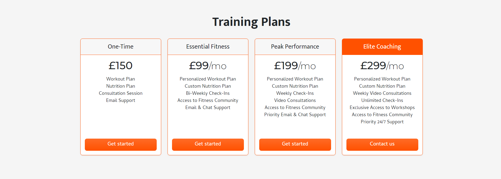

- **Contact Form**

    - The Contact Form section invites users to get in touch for more information or inquiries, with a prompt to check the FAQ for common questions. This section is designed to facilitate easy communication between potential clients and JB Fit, enhancing the user experience by providing a straightforward way to ask questions or start the sign-up process.

		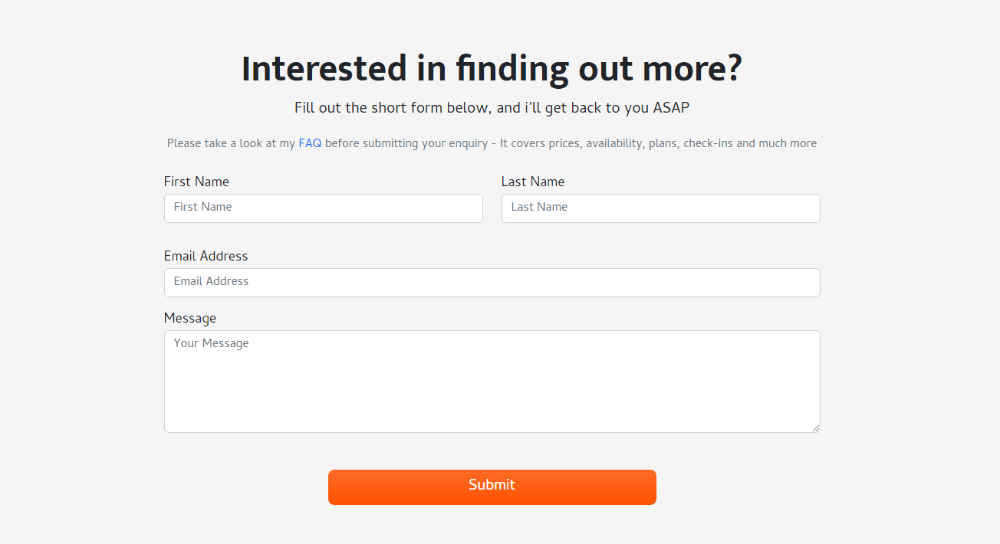

### About Page

- **Inspirational quote - Hero**

    - The About page opens with a powerful and inspirational quote, which sets a motivational tone for visitors. This section uses a full-width, centred layout with a bold, white font against a hero image, making the quote stand out. The quote encapsulates the philosophy of perseverance and determination, resonating with the core values of the JB Fit coaching program.

		

- **Biography**

    - The Coach Biography section provides a detailed overview of the coach's background, including academic qualifications, certifications, and professional experience. This section builds credibility and trust by highlighting the coach’s expertise and the personalized approach they bring to their training. The biography is divided into text and bullet points, making it easy for users to digest the information and understand the coach’s qualifications and commitment to continuous learning.

		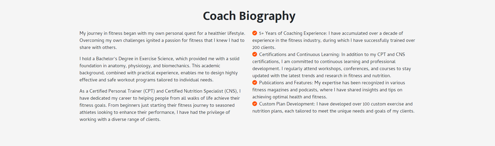

- **Mission and Vision**

    - The Mission and Vision section clearly outlines the purpose and goals of JB Fit. The mission statement emphasizes the commitment to empowering individuals through personalized coaching and supportive community engagement. The vision statement reflects the long-term goals of making professional fitness coaching accessible to all and fostering a culture of health and wellness. This section is essential for communicating the core values and long-term aspirations of the brand to potential clients.

		

- **Personal Fitness Philosophy**

    - The Personal Fitness Philosophy section is a key feature that showcases the coach's unique approach to fitness. It emphasizes a holistic and sustainable approach to health and wellness, focusing not only on physical strength but also on mental resilience and overall well-being. The section is visually divided into individual cards, each highlighting a different aspect of the coach’s philosophy, such as Individualized Approach, Sustainable Practices, Holistic Health, Continuous Learning, and Community Support. This layout makes the philosophy accessible and relatable to users, encouraging them to connect with the values of JB Fit.

		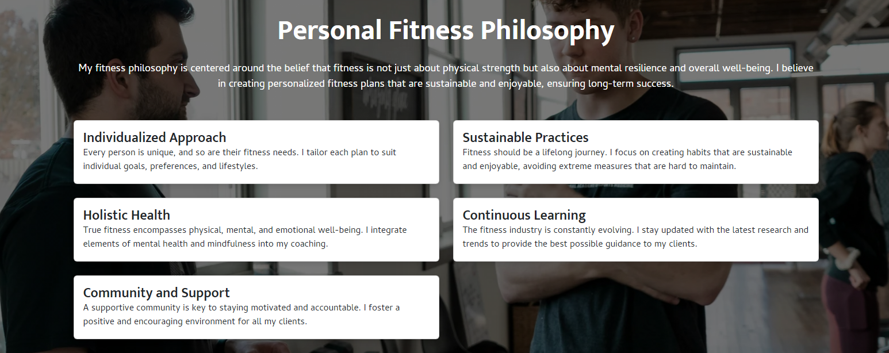

### Plans Page

- **Training Plans**

    - The Training Plans section offers users a detailed overview of the different fitness packages available at JB Fit. Each plan is presented in a clean, card-based layout, making it easy for users to compare options and select the one that best suits their needs. The plans include various levels of support and customization, from a one-time plan to the comprehensive Elite Coaching package. This section is essential for helping users make informed decisions about their fitness journey and provides clear pricing for each option.

		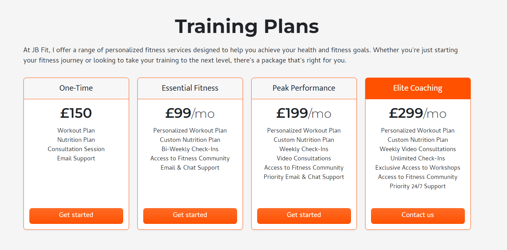

- **Why Choose My Plans?**

    - This section highlights the key advantages of choosing JB Fit’s training plans, such as Expertise, Customization, Support, and Results. Each benefit is visually represented with an icon and a brief description, reinforcing the value of the services offered. This section is designed to build trust and confidence in potential clients by emphasizing the quality and effectiveness of the plans.

		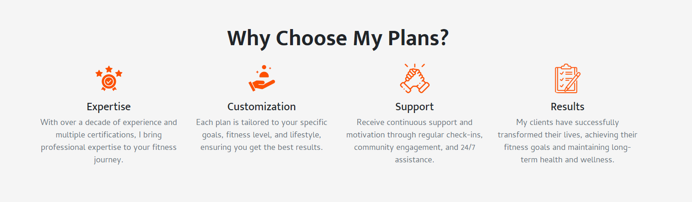

### FAQ Page

- **FAQ Section**

    - The FAQ section is designed with an accordion layout, which organizes frequently asked questions into expandable panels. This structure makes it easy for users to find answers to their specific questions without having to scroll through long blocks of text. The accordion is divided into multiple categories such as General Questions, Services & Packages, Pricing & Payments, Personalized Plans, Support & Community, and Getting Started. Each category addresses key areas of interest for potential and current clients, providing detailed and helpful information to guide them through their fitness journey with JB Fit.

		
		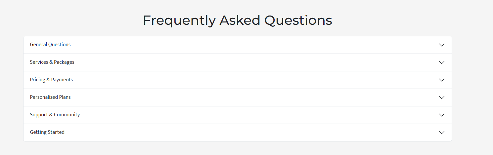

- **General Questions**

    - This section addresses broad, introductory questions about JB Fit, such as what the platform is and how online personal training works. It helps new visitors quickly understand the core services offered and the benefits of choosing JB Fit for their fitness needs.

		

- **Services & Packages**

    - The Services & Packages section provides detailed information about the various services available and helps users decide which package is right for them. This section is crucial for helping potential clients understand the offerings and make an informed decision about which plan best suits their fitness goals.

		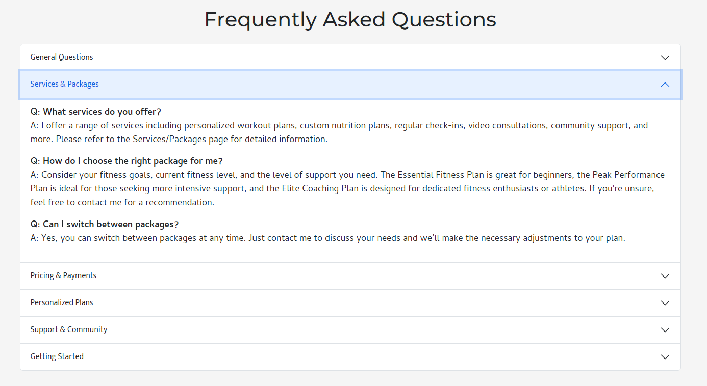

- **Pricing & Payments**

    - This section covers important information about payment methods, discounts, and cancellation policies. It ensures that users are fully informed about the financial aspects of signing up for JB Fit services, providing transparency and building trust with potential clients.

		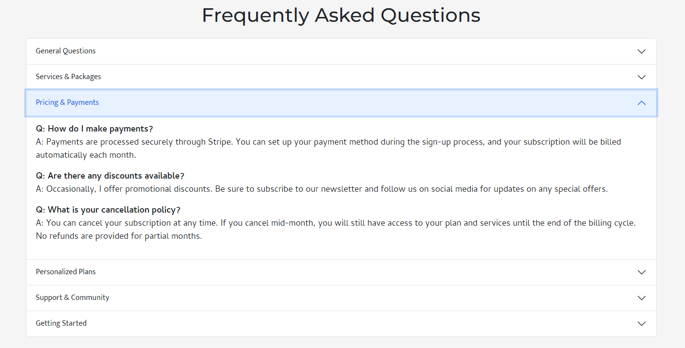

- **Personalized Plans**

    - The Personalized Plans section explains how JB Fit customizes workout and nutrition plans based on each client's unique needs and preferences. It highlights the flexibility and personalized attention clients receive, which are key selling points for JB Fit's services.

		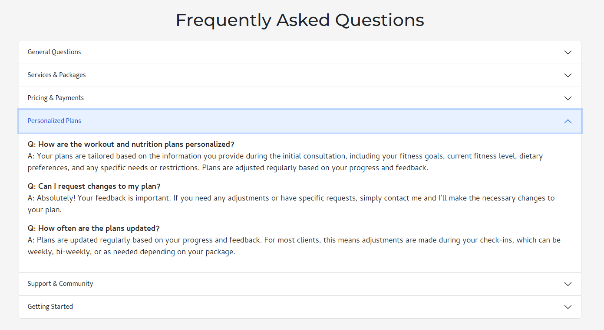

- **Support & Community**

    - This section outlines the various levels of support available to clients, including check-ins, email and chat support, video consultations, and access to a supportive community. It emphasizes the ongoing support that clients receive, which is essential for maintaining motivation and achieving long-term success.

		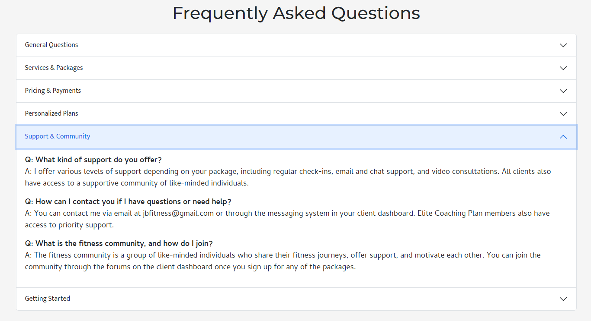

- **Getting Started**

    - The Getting Started section provides a step-by-step guide for new clients on how to begin their journey with JB Fit. It covers the initial consultation process and the information required to create a personalized plan. This section is designed to make onboarding new clients as smooth and straightforward as possible.

		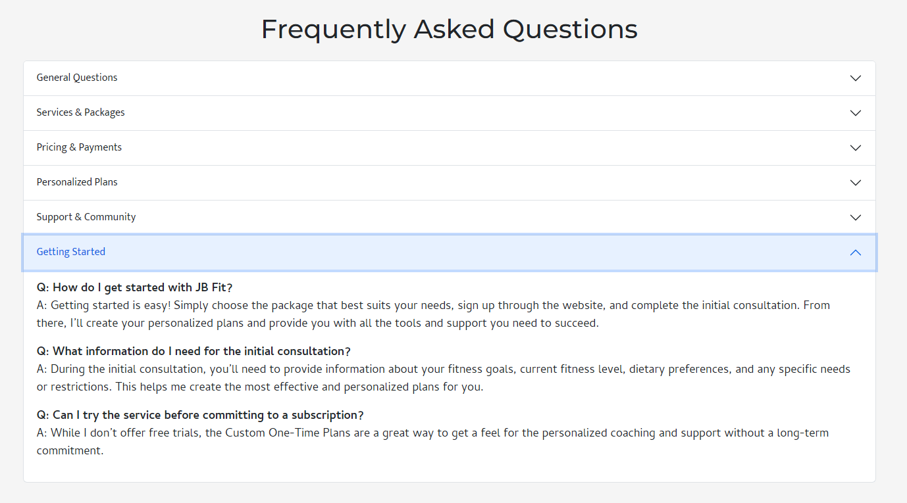

### Profile Page

- **User Profile Overview**

	- The profile page provides a comprehensive overview of the user's personal information and fitness metrics. It includes sections for personal information, physical measurements, a weight progress tracker, weight log history, and the option to upload progress pictures. This structured layout allows users to easily monitor and update their fitness journey in one centralized location, making it a vital tool for personal accountability and tracking progress.

		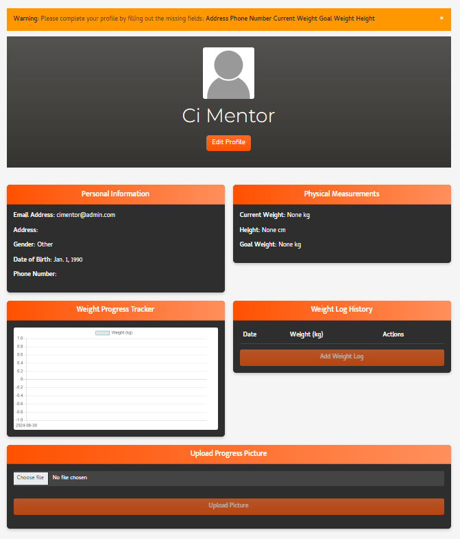

- **Personal Information Management**

	- Users can view and update their personal details, including email, address, gender, date of birth, and phone number, ensuring that their profile is always accurate and up-to-date.

		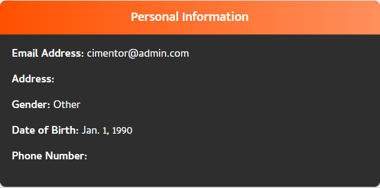
	
- **Physical Measurements Tracking**

	- The physical measurements section displays the user's current weight, height, and goal weight, providing a quick snapshot of their fitness status and goals.

		

- **Weight Progress Tracker**

	- A visual graph allows users to track their weight changes over time, providing a clear visual representation of their progress towards their fitness goals.

		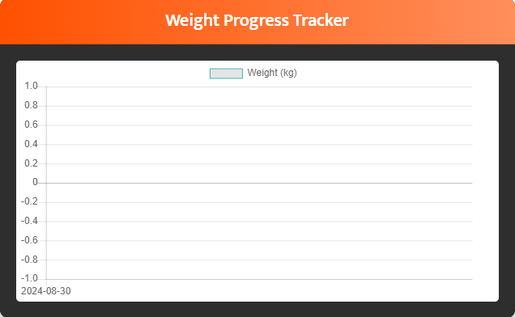

- **Weight Log History**

	- The weight log feature on the profile page allows users to track their weight over time by adding new entries. However, the feature includes a validation mechanism that disables the "Add Weight Log" button if required information, such as the current weight or goal weight, is missing from the user's personal information. A tooltip is displayed explaining why the button is disabled, guiding users to complete their profile before they can log their weight. This validation ensures that users maintain accurate and complete data, enhancing the effectiveness of their progress tracking.

		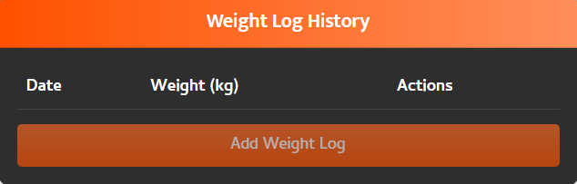
		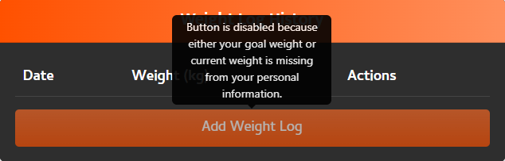

- **Progress Picture Upload**

	- The progress picture upload feature allows users to visually track their fitness journey by uploading images of their progress. However, similar to the weight log feature, this functionality includes a validation mechanism that disables the "Upload Picture" button if required data, such as the current weight or goal weight, is missing from the user's personal information. A tooltip provides a clear explanation for the button’s disabled state, guiding users to complete their profile before they can upload progress pictures. This validation helps ensure that all relevant data is in place, making the progress tracking more effective and meaningful.

		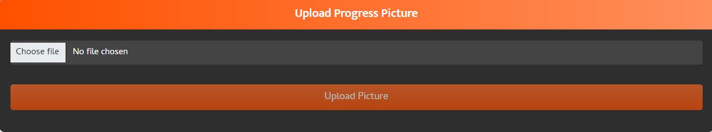
		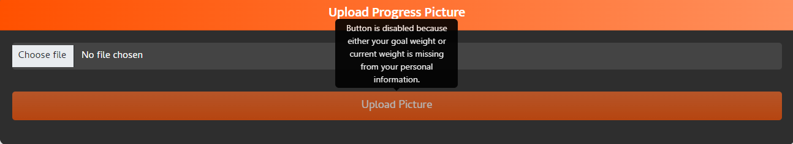
		
- **Edit Profile Page**

	- The profile edit page allows users to manage and update their personal information, including profile picture, contact details, and fitness metrics such as current weight, height, and goal weight. The page features a clean and user-friendly design with clear input fields, making it easy for users to keep their profiles up-to-date. It includes essential functionalities like secure data handling, navigation back to the profile overview, and an option to delete the account, giving users full control over their personal data.

		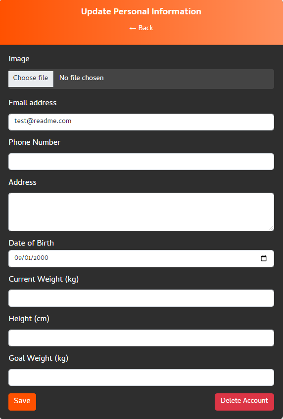

### Login Page

- **Login Form**

	- The login form is designed to provide a seamless and user-friendly experience for users trying to access their accounts. It includes standard input fields for the username/email and password, and a visually appealing layout that aligns with the overall JB Fit branding. The form is easy to navigate, and the use of clear labels and placeholders ensures that users can quickly understand the required information. The design includes responsive elements to ensure compatibility with various device sizes, providing a consistent experience across desktops, tablets, and mobile devices.

		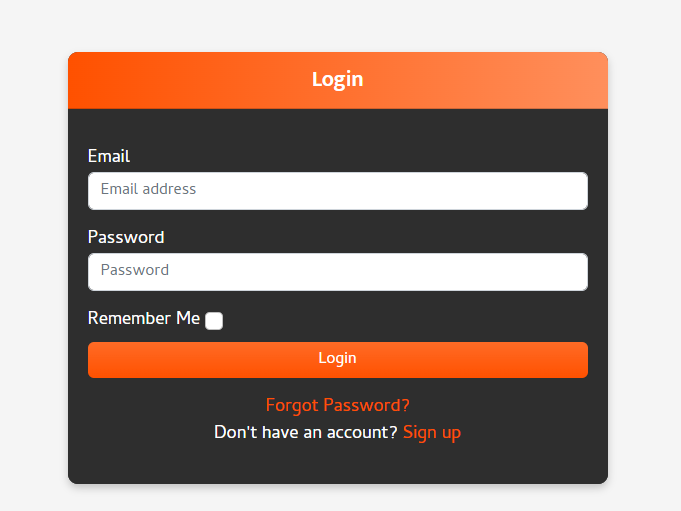

- **Error Handling and Validation**

	- The login form includes robust error handling and validation features to guide users when inputting incorrect information. If errors occur, such as missing or incorrect credentials, clear and concise error messages are displayed within the form. These error messages are highlighted in a distinct alert box with a close button, making it easy for users to correct their inputs and resubmit the form. This functionality improves the overall user experience by providing immediate feedback and reducing the frustration of multiple failed login attempts.

		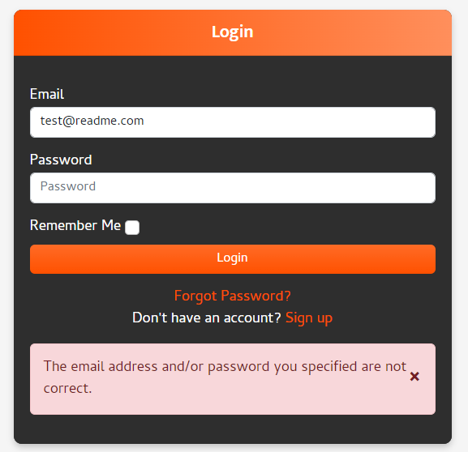

- **Forgot Password Link**

	- A "Forgot Password?" link is prominently placed beneath the login button, allowing users who have forgotten their passwords to easily initiate the password reset process. This feature is crucial for user retention, as it provides a straightforward path to regain account access, thereby reducing barriers and potential drop-offs due to forgotten credentials.

		

- **Sign-Up Redirect**

	- The login page also includes a prompt for users who do not have an account, directing them to the registration page with a "Sign up" link. This feature encourages new user acquisition by providing a clear call-to-action for potential clients who have landed on the login page but have yet to create an account. It seamlessly integrates the onboarding process, making it easy for new users to join JB Fit.

		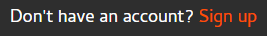

### Registration Page

- **Sign up Form**
	- The sign-up form provides a comprehensive and user-friendly registration experience for new users. It includes fields for first name, last name, gender, date of birth, email, and password, ensuring all necessary information is captured to create a personalized account. The form is laid out in a clear and intuitive manner, making it easy for users to complete the registration process. This feature is essential for onboarding new clients and expanding the JB Fit community.

		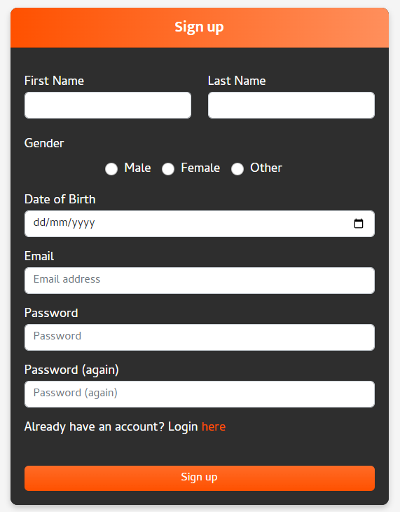
	
- **Sign up Form Validation**

	- The sign-up form incorporates robust error handling and validation to guide users through the registration process. If any errors occur, such as missing or incorrectly formatted information, the form provides immediate feedback with clear and concise error messages displayed next to the relevant fields. This helps users correct their mistakes easily and proceed with the registration process, enhancing the overall user experience.

		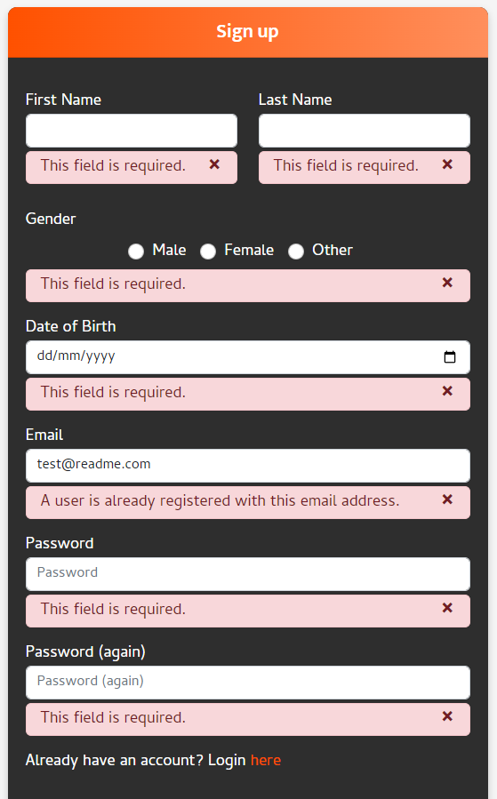

### Reset Password

- **Reset Password Form**

	- The password reset form allows users to securely reset their passwords if they have forgotten them. It features a clean and straightforward interface, requiring only the user's email address to initiate the password reset process. The design is visually appealing, with contrasting colors and clear prompts to guide the user through the process. This feature enhances the overall user experience by providing an easy way for users to regain access to their accounts without needing to contact support.

		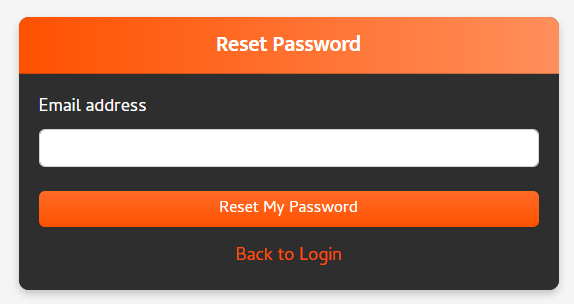

- **Check your Email**

	- After a user submits their email address for password reset, they are presented with a confirmation message that instructs them to check their inbox for a reset link. This feature provides clear guidance on the next steps, enhancing the user experience by setting proper expectations. It also includes a helpful reminder to check the spam folder if the email does not appear in the inbox promptly, addressing a common user pain point.

		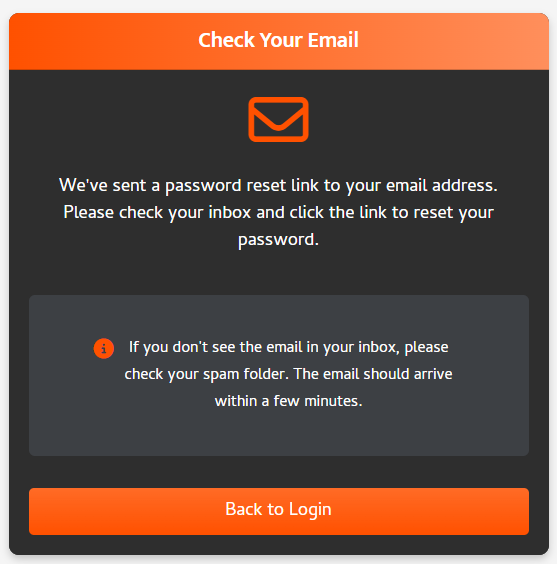

### Checkout

- **Checkout Page**

	- The checkout page provides a streamlined and user-friendly interface for completing purchases on the JB Fit platform. It features two main sections: "Checkout Details" and "Order Summary." In the "Checkout Details" section, users can enter their personal and payment information, including their first and last name, email, phone number, and credit card details. The "Order Summary" section displays a clear breakdown of the selected training plan, its description, and the total cost, ensuring transparency and accuracy before finalizing the payment. This layout ensures a smooth and efficient checkout process, enhancing the overall user experience.

		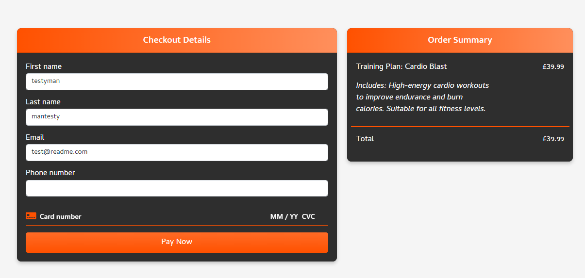

- **Payment Successful**

	- The payment successful page confirms the completion of a user's purchase in a clear and reassuring manner. It features a confirmation message that thanks the user for their purchase and notifies them that a confirmation email has been sent to their specified email address. Below the confirmation, the "Purchase Details" section provides specific information about the purchased training plan, including the plan name, duration, access details, and the exact purchase date and time. This feature enhances the user experience by providing immediate feedback and clear next steps after a purchase, reinforcing a sense of trust and satisfaction.

		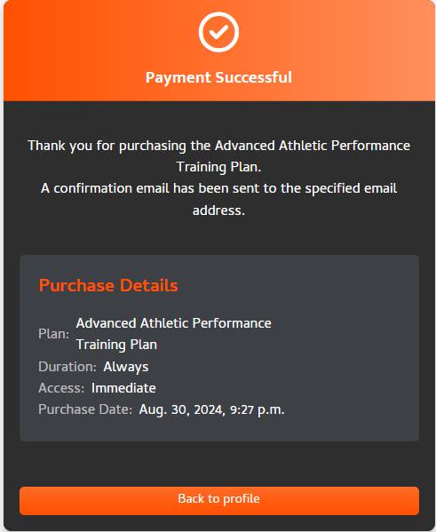

### 404 Page

- The 404 page informs users that the requested page is not found and provides navigation options to return to the home page or other sections. This enhances site usability by preventing dead ends and guiding users back to functional areas, ensuring a smooth browsing experience.

	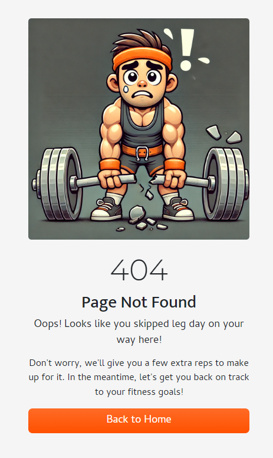

### Future Features

- **Community Forum**: The Community Forum will serve as a dedicated space where users can connect, share their fitness journeys, ask questions, and support each other. This feature aims to foster a sense of community among JB Fit users, allowing them to engage in discussions about workouts, nutrition tips, success stories, and challenges. The forum will include topic-specific threads, private messaging, and the ability to follow and interact with other users’ posts. This interactive platform will enhance user engagement, encourage knowledge sharing, and provide a supportive environment for individuals striving to reach their fitness goals.

- **Social Media Integration**: Social Media Integration will allow users to log in or sign up using their existing social media accounts, such as Facebook, Google, or Twitter. This feature aims to streamline the login process, making it quicker and more convenient for users to access their accounts. By reducing the barriers to entry, social media login integration will help improve user acquisition and retention rates. Additionally, it will provide an easy way for users to share their progress and milestones directly on their social media profiles, enhancing the visibility of JB Fit within their personal networks.


## Tools & Technologies Used

- [](https://tim.2bn.dev/markdown-builder) used to generate README and TESTING templates.
- [](https://git-scm.com) used for version control. (`git add`, `git commit`, `git push`)
- [](https://github.com) used for secure online code storage.
- [](https://code.visualstudio.com) used as my local IDE for development.
- [](https://en.wikipedia.org/wiki/HTML) used for the main site content.
- [](https://en.wikipedia.org/wiki/CSS) used for the main site design and layout.
- [](https://www.javascript.com) used for user interaction on the site.
- [](https://jquery.com) used for user interaction on the site.
- [](https://www.python.org) used as the back-end programming language.
- [](https://www.heroku.com) used for hosting the deployed back-end site.
- [](https://getbootstrap.com) used as the front-end CSS framework for modern responsiveness and pre-built components.
- [](https://jestjs.io) used for automated JavaScript testing.
- [](https://www.djangoproject.com) used as the Python framework for the site.
- [](https://www.postgresql.org) used as the relational database management.
- [](https://dbs.ci-dbs.net) used as the Postgres database from Code Institute.
- [](https://cloudinary.com) used for online static file storage.
- [](https://stripe.com) used for online secure payments of ecommerce products/services.
- [](https://mail.google.com) used for sending emails in my application.
- [](https://aws.amazon.com/s3) used for online static file storage.
- [](https://www.figma.com) used for creating wireframes.
- [](https://fontawesome.com) used for the icons.
- [](https://chat.openai.com) used to help debug, troubleshoot, and explain things.
- [](https://www.mermaidchart.com/) used for creating ERD diagrams.
- [](https://djecrety.ir/) used for generating django secret keys.
- [](https://www.stackedit.io) used as an in-browser markdown editor.
- [](https://logo.com/) used to create the logo for the website.
- [](https://imageresizer.com/) used compress and resize images.
- [](https://app.prntscr.com/en/index.html) used to provide the screenshots for the readme and testing.


## Database Design

Entity Relationship Diagrams (ERD) help to visualize database architecture before creating models.
Understanding the relationships between different tables can save time later in the project.

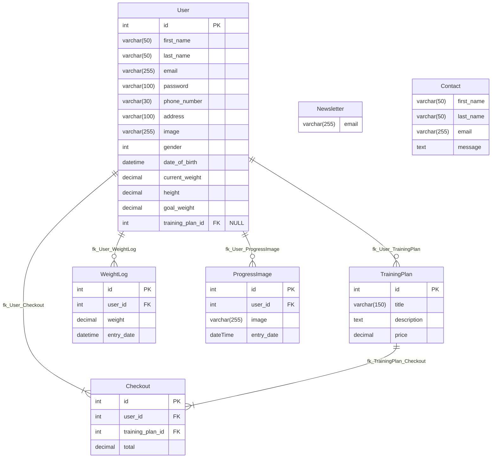
```mermaid
erDiagram
User ||--o{ TrainingPlan : fk_User_TrainingPlan
User ||--|{ Checkout : fk_User_Checkout
User ||--o{ WeightLog : fk_User_WeightLog
User ||--o{ ProgressImage : fk_User_ProgressImage
TrainingPlan ||--|{ Checkout : fk_TrainingPlan_Checkout


User {
  int id  PK
  varchar(50) first_name
  varchar(50) last_name
  varchar(255) email
  varchar(100) password
  varchar(30) phone_number
  varchar(100) address
  varchar(255) image
  int gender
  datetime date_of_birth
  decimal current_weight
  decimal height
  decimal goal_weight
  int training_plan_id  FK  "NULL"
}

TrainingPlan {
  int id  PK
  varchar(150) title
  text description
  decimal price
}

WeightLog {
  int id  PK
  int user_id  FK
  decimal weight
  datetime entry_date
}

ProgressImage {
  int id  PK
  int user_id  FK
  varchar(255) image
  dateTime entry_date
}

Checkout {
  int id  PK
  int user_id  FK
  int training_plan_id  FK
  decimal total
}

Newsletter {
  varchar(255) email
}

Contact {
  varchar(50) first_name
  varchar(50) last_name
  varchar(255) email
  text message
}
```

I have used [mermaidchart](https://www.mermaidchart.com/) to generate an ERD.

## Agile Development Process

### GitHub Projects

[GitHub Projects](https://github.com/Jordan-Boulton1/jb-fit/projects?query=is%3Aopen) served as an Agile tool for this project.
It isn't a specialized tool, but with the right tags and project creation/issue assignments, it can be made to work.

Through it, user stories, issues, and milestone tasks were planned, then tracked on a weekly basis using the basic Kanban board.

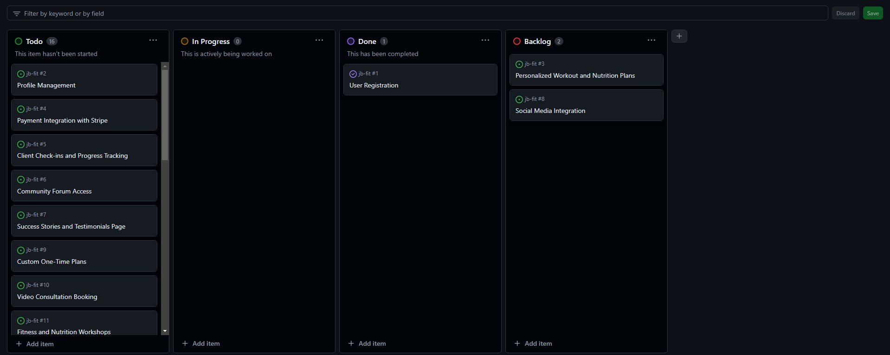

### GitHub Issues

[GitHub Issues](https://github.com/Jordan-Boulton1/peak-performance/issues) served as an another Agile tool.
There, I used my own **User Story Template** to manage user stories.

It also helped with milestone iterations on a weekly basis.

- [Open Issues](https://github.com/Jordan-Boulton1/peak-performance/issues) [](https://github.com/Jordan-Boulton1/peak-performance/issues)

    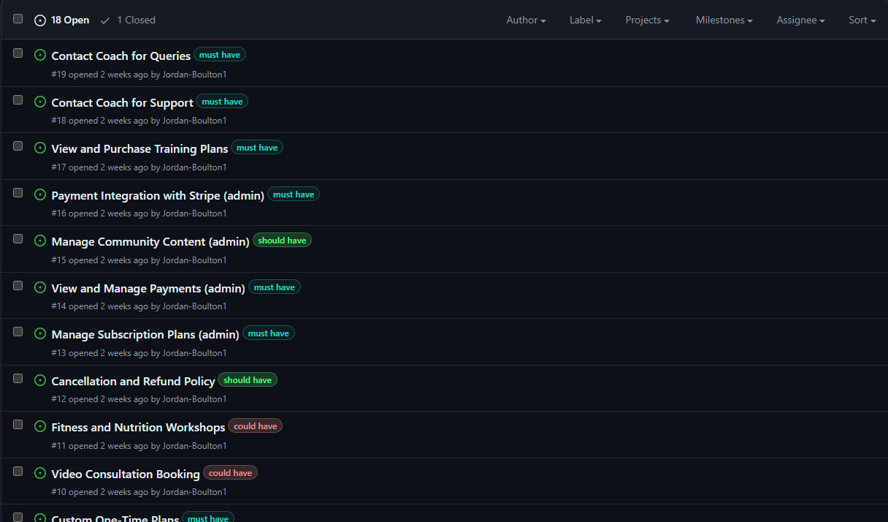

- [Closed Issues](https://github.com/Jordan-Boulton1/peak-performance/issues?q=is%3Aissue+is%3Aclosed) [](https://github.com/Jordan-Boulton1/peak-performance/issues?q=is%3Aissue+is%3Aclosed)

    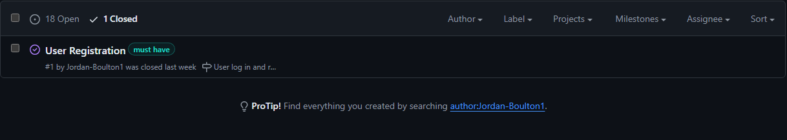

### MoSCoW Prioritization

I've decomposed my Epics into stories prior to prioritizing and implementing them.
Using this approach, I was able to apply the MoSCow prioritization and labels to my user stories within the Issues tab.

- **Must Have**: guaranteed to be delivered (*max 60% of stories*)
- **Should Have**: adds significant value, but not vital (*the rest ~20% of stories*)
- **Could Have**: has small impact if left out (*20% of stories*)
- **Won't Have**: not a priority for this iteration

### Milestones

To achieve success in the implementation of this project, I have setup milestones for the end of each week, which represented my "sprints". My approach to solving the business problem in the domain area was to do vertical slicing of the system, instead of horizontal - an approach that I have used so far in my projects. Vertical slicing focuses on ensuring that at the end of each sprint you are able to produce something in the system that is deployable, worthy of a "demo", and that is useable by the client.

| Milestone | Screenshot |
| ------ | ------- |
| [User login and registration](https://github.com/Jordan-Boulton1/jb-fit/milestone/1?closed=1) | 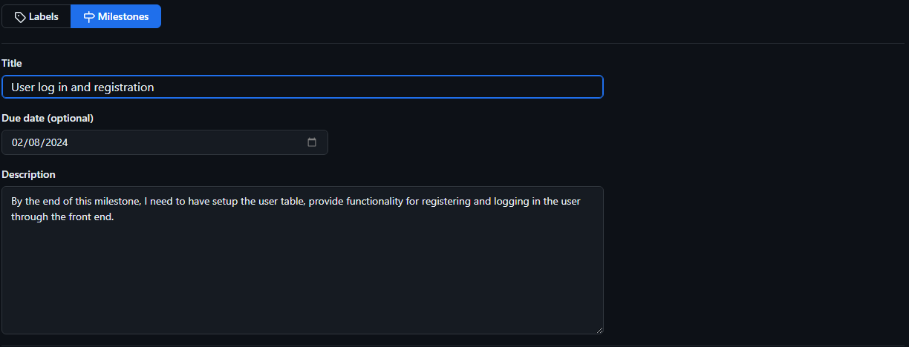 |
| [User Profile CRUD](https://github.com/Jordan-Boulton1/jb-fit/milestone/3?closed=1) | 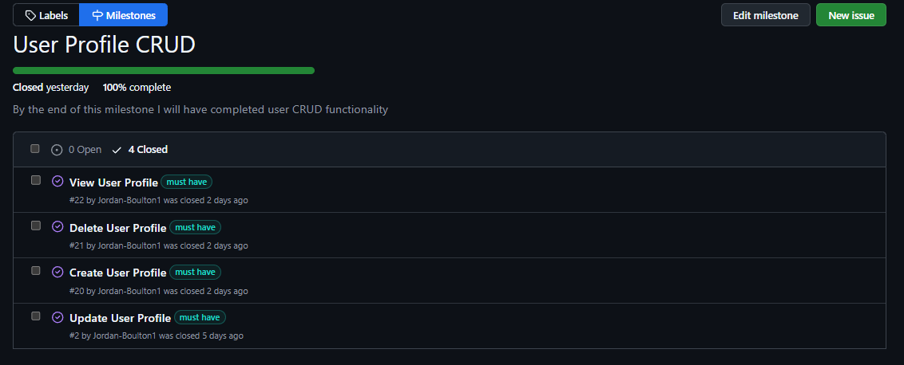 |
| [Weight Log CRUD](https://github.com/Jordan-Boulton1/jb-fit/milestone/4?closed=1) |  |
| [Newsletter](https://github.com/Jordan-Boulton1/jb-fit/milestone/5?closed=1) | 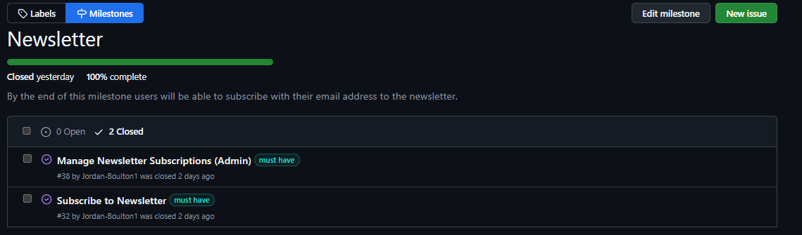 |
| [Progress Images](https://github.com/Jordan-Boulton1/jb-fit/milestone/6?closed=1) | 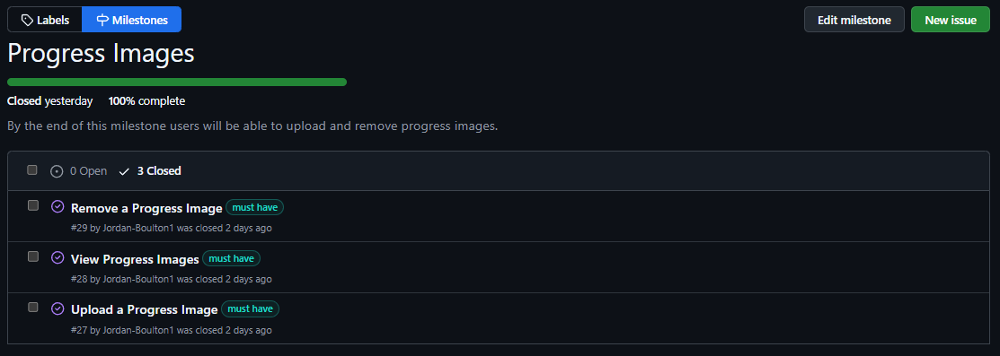 |
| [Format Code](https://github.com/Jordan-Boulton1/jb-fit/milestone/2) |  |

## Ecommerce Business Model

This site sells goods to individual customers, and therefore follows a `Business to Customer` model.
It is of the simplest **B2C** forms, as it focuses on individual transactions, and doesn't need anything
such as monthly/annual subscriptions.

It is still in its early development stages, although it already has a newsletter, and links for social media marketing.

Social media can potentially build a community of users around the business, and boost site visitor numbers,
especially when using larger platforms such a Facebook.

A newsletter list can be used by the business to send regular messages to site users.
For example, what items are on special offer, new items in stock,
updates to business hours, notifications of events, and much more!

### Sitemap

I've used [XML-Sitemaps](https://www.xml-sitemaps.com) to generate a sitemap.xml file.
This was generated using my deployed site URL: https://ci-jb-fit-73ac55dce174.herokuapp.com/

After it finished crawling the entire site, it created a
[sitemap.xml](sitemap.xml) which I've downloaded and included in the repository.

### Robots

I've created the [robots.txt](robots.txt) file at the root-level.
Inside, I've included the default settings:

```
User-agent: *
Disallow:
Sitemap: https://ci-jb-fit-73ac55dce174.herokuapp.com/sitemap.xml
```

Further links for future implementation:
- [Google search console](https://search.google.com/search-console)
- [Creating and submitting a sitemap](https://developers.google.com/search/docs/advanced/sitemaps/build-sitemap)
- [Managing your sitemaps and using sitemaps reports](https://support.google.com/webmasters/answer/7451001)
- [Testing the robots.txt file](https://support.google.com/webmasters/answer/6062598)

### Social Media Marketing

Creating a strong social base (with participation) and linking that to the business site can help drive sales.
Using more popular providers with a wider user base, such as Facebook, typically maximizes site views.

I've created a mockup Facebook business account.

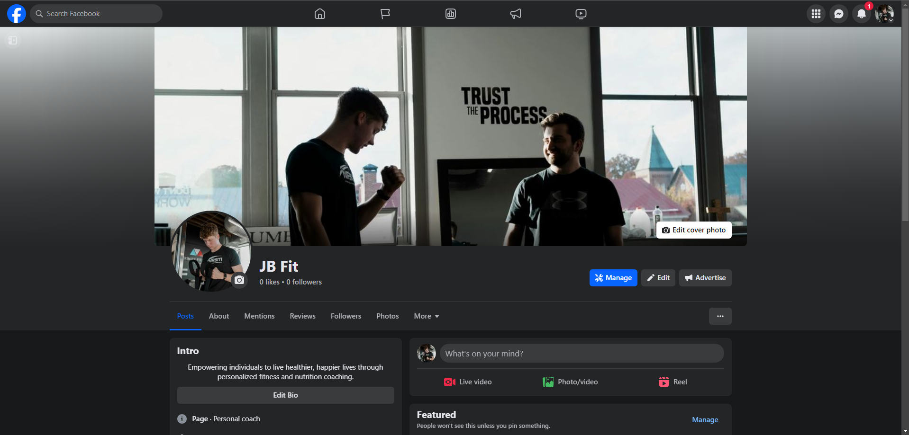
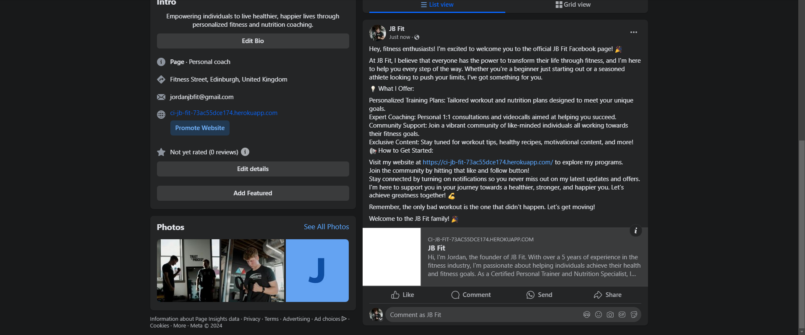

### Newsletter Marketing

I have incorporate a newsletter sign-up form on my application, to allow users to supply their
email address if they are interested in learning more.


## Testing

> [!NOTE]  
> For all testing, please refer to the [TESTING.md](TESTING.md) file.

## Deployment

The live deployed application can be found deployed on [Heroku](https://ci-jb-fit-73ac55dce174.herokuapp.com/).

### PostgreSQL Database

This project uses a [Code Institute PostgreSQL Database](https://dbs.ci-dbs.net).

To obtain my own Postgres Database from Code Institute, I followed these steps:

- Signed-in to the CI LMS using my email address.
- An email was sent to me with my new Postgres Database.

> [!CAUTION]  
> - PostgreSQL databases by Code Institute are only available to CI Students.
> - You must acquire your own PostgreSQL database through some other method
> if you plan to clone/fork this repository.
> - Code Institute students are allowed a maximum of 8 databases.
> - Databases are subject to deletion after 18 months.

### Amazon AWS

This project uses [AWS](https://aws.amazon.com) to store static files and images online, due to the fact that Heroku doesn't persist this type of data.

Once you've created an AWS account and logged-in, follow these series of steps to get your project connected.
Make sure you're on the **AWS Management Console** page.

#### S3 Bucket

- Search for **S3**.
- Create a new bucket, give it a name (matching your Heroku app name), and choose the region closest to you.
- Uncheck **Block all public access**, and acknowledge that the bucket will be public (required for it to work on Heroku).
- From **Object Ownership**, make sure to have **ACLs enabled**, and **Bucket owner preferred** selected.
- From the **Properties** tab, turn on static website hosting, and type `index.html` and `error.html` in their respective fields, then click **Save**.
- From the **Permissions** tab, paste in the following CORS configuration:

	```shell
	[
		{
			"AllowedHeaders": [
				"Authorization"
			],
			"AllowedMethods": [
				"GET"
			],
			"AllowedOrigins": [
				"*"
			],
			"ExposeHeaders": []
		}
	]
	```

- Copy your **ARN** string.
- From the **Bucket Policy** tab, select the **Policy Generator** link, and use the following steps:
	- Policy Type: **S3 Bucket Policy**
	- Effect: **Allow**
	- Principal: `*`
	- Actions: **GetObject**
	- Amazon Resource Name (ARN): **paste-your-ARN-here**
	- Click **Add Statement**
	- Click **Generate Policy**
	- Copy the entire Policy, and paste it into the **Bucket Policy Editor**

		```shell
		{
			"Id": "Policy1234567890",
			"Version": "2012-10-17",
			"Statement": [
				{
					"Sid": "Stmt1234567890",
					"Action": [
						"s3:GetObject"
					],
					"Effect": "Allow",
					"Resource": "arn:aws:s3:::your-bucket-name/*"
					"Principal": "*",
				}
			]
		}
		```

	- Before you click "Save", add `/*` to the end of the Resource key in the Bucket Policy Editor (like above).
	- Click **Save**.
- From the **Access Control List (ACL)** section, click "Edit" and enable **List** for **Everyone (public access)**, and accept the warning box.
	- If the edit button is disabled, you need to change the **Object Ownership** section above to **ACLs enabled** (mentioned above).

#### IAM

Back on the AWS Services Menu, search for and open **IAM** (Identity and Access Management).
Once on the IAM page, follow these steps:

- From **User Groups**, click **Create New Group**.
	- Suggested Name: `group-peak-performance` (group + the project name)
- Tags are optional, but you must click it to get to the **review policy** page.
- From **User Groups**, select your newly created group, and go to the **Permissions** tab.
- Open the **Add Permissions** dropdown, and click **Attach Policies**.
- Select the policy, then click **Add Permissions** at the bottom when finished.
- From the **JSON** tab, select the **Import Managed Policy** link.
	- Search for **S3**, select the `AmazonS3FullAccess` policy, and then **Import**.
	- You'll need your ARN from the S3 Bucket copied again, which is pasted into "Resources" key on the Policy.

		```shell
		{
			"Version": "2012-10-17",
			"Statement": [
				{
					"Effect": "Allow",
					"Action": "s3:*",
					"Resource": [
						"arn:aws:s3:::your-bucket-name",
						"arn:aws:s3:::your-bucket-name/*"
					]
				}
			]
		}
		```
	
	- Click **Review Policy**.
	- Suggested Name: `policy-peak-performance` (policy + the project name)
	- Provide a description:
		- "Access to S3 Bucket for peak-performance static files."
	- Click **Create Policy**.
- From **User Groups**, click your "group-peak-performance".
- Click **Attach Policy**.
- Search for the policy you've just created ("policy-peak-performance") and select it, then **Attach Policy**.
- From **User Groups**, click **Add User**.
	- Suggested Name: `user-peak-performance` (user + the project name)
- For "Select AWS Access Type", select **Programmatic Access**.
- Select the group to add your new user to: `group-peak-performance`
- Tags are optional, but you must click it to get to the **review user** page.
- Click **Create User** once done.
- You should see a button to **Download .csv**, so click it to save a copy on your system.
	- **IMPORTANT**: once you pass this page, you cannot come back to download it again, so do it immediately!
	- This contains the user's **Access key ID** and **Secret access key**.
	- `AWS_ACCESS_KEY_ID` = **Access key ID**
	- `AWS_SECRET_ACCESS_KEY` = **Secret access key**

#### Final AWS Setup

- If Heroku Config Vars has `DISABLE_COLLECTSTATIC` still, this can be removed now, so that AWS will handle the static files.
- Back within **S3**, create a new folder called: `media`.
- Select any existing media images for your project to prepare them for being uploaded into the new folder.
- Under **Manage Public Permissions**, select **Grant public read access to this object(s)**.
- No further settings are required, so click **Upload**.

### Cloudinary API

This project uses the [Cloudinary API](https://cloudinary.com) to store media assets online, due to the fact that Heroku doesn't persist this type of data.

To obtain your own Cloudinary API key, create an account and log in.

- For *Primary interest*, you can choose *Programmable Media for image and video API*.
- Optional: *edit your assigned cloud name to something more memorable*.
- On your Cloudinary Dashboard, you can copy your **API Environment Variable**.
- Be sure to remove the `CLOUDINARY_URL=` as part of the API **value**; this is the **key**.

### Stripe API

This project uses [Stripe](https://stripe.com) to handle the ecommerce payments.

Once you've created a Stripe account and logged-in, follow these series of steps to get your project connected.

- From your Stripe dashboard, click to expand the "Get your test API keys".
- You'll have two keys here:
	- `STRIPE_PUBLIC_KEY` = Publishable Key (starts with **pk**)
	- `STRIPE_SECRET_KEY` = Secret Key (starts with **sk**)

As a backup, in case users prematurely close the purchase-order page during payment, we can include Stripe Webhooks.

- From your Stripe dashboard, click **Developers**, and select **Webhooks**.
- From there, click **Add Endpoint**.
	- `https://jb-ci-boutique-ado-0fd50c244260.herokuapp.com/checkout/wh/`
- Click **receive all events**.
- Click **Add Endpoint** to complete the process.
- You'll have a new key here:
	- `STRIPE_WH_SECRET` = Signing Secret (Wehbook) Key (starts with **wh**)

### Gmail API

This project uses [Gmail](https://mail.google.com) to handle sending emails to users for account verification and purchase order confirmations.

Once you've created a Gmail (Google) account and logged-in, follow these series of steps to get your project connected.

- Click on the **Account Settings** (cog icon) in the top-right corner of Gmail.
- Click on the **Accounts and Import** tab.
- Within the section called "Change account settings", click on the link for **Other Google Account settings**.
- From this new page, select **Security** on the left.
- Select **2-Step Verification** to turn it on. (verify your password and account)
- Once verified, select **Turn On** for 2FA.
- Navigate back to the **Security** page, and you'll see a new option called **App passwords**.
- This might prompt you once again to confirm your password and account.
- Select **Mail** for the app type.
- Select **Other (Custom name)** for the device type.
	- Any custom name, such as "Django" or peak-performance
- You'll be provided with a 16-character password (API key).
	- Save this somewhere locally, as you cannot access this key again later!
	- `EMAIL_HOST_PASS` = user's 16-character API key
	- `EMAIL_HOST_USER` = user's own personal Gmail email address

## Credits

### Content

| Source | Location | Notes |
| --- | --- | --- |
| [Markdown Builder](https://tim.2bn.dev/markdown-builder) | README and TESTING | tool to help generate the Markdown files |
| [W3Schools](https://www.w3schools.com/howto/howto_js_topnav_responsive.asp) | entire site | responsive HTML/CSS/JS navbar |
| [W3Schools](https://www.w3schools.com/howto/howto_css_modals.asp) | profile page | interactive pop-up (modal) |
| [W3Schools](https://www.w3schools.com/css/css3_variables.asp) | entire site | how to use CSS :root variables |
| [strftime](https://strftime.org) | CRUD functionality | helpful tool to format date/time from string |
| [Bootstrap](https://getbootstrap.com/docs/5.2/components/accordion/) | FAQ page | interactive accordion |
| [BootstrapBrain](https://bootstrapbrain.com/component/bootstrap-5-services-section-card-design-example/#code) | home page | card template |
| [David Kingsbury](https://www.davidkingsbury.co.uk/) | entire page | used as inspiration when building the website. |
| [Gymsick](https://pxdraft.com/wrap/gymsick/) | entire page | used as inspiration when building the website. |
| [Chart](https://www.chartjs.org/docs/latest/) | profile page | helpful chart tool used to visual weight progress. |
| [Vercel](https://v0.dev/) | entire site | helpful tool to generate mock-up pages for inspiration |
| [Amp-What](https://www.amp-what.com/) | entire site | helpful tool to find characters and icons |
| [GitHub](https://docs.github.com/en/get-started/writing-on-github/working-with-advanced-formatting/creating-diagrams) | readme | implementing the ERD diagram |

### Media

| Source | Location | Type | Notes |
| --- | --- | --- | --- |
| [Unsplash](https://unsplash.com/photos/a-young-man-working-out-with-a-barbell-rW5H8kZ5wSc) | home page | image | hero image background |
| [Unsplash](https://unsplash.com/photos/w9NE_4XfRBo) | home page | image | about image |
| [Flaticon](https://www.flaticon.com/free-icon/flexibility_4471955?term=flexibility&page=1&position=41&origin=search&related_id=4471955) | home page | image | flexibility icon |
| [Flaticon](https://www.flaticon.com/free-icon/personalized_15765387?term=personalization&page=1&position=3&origin=tag&related_id=15765387) | home page | image | personalization icon |
| [Flaticon](https://www.flaticon.com/free-icon/world_3187401?term=world+pin&page=1&position=14&origin=search&related_id=3187401) | home page | image | accessibility icon |
| [Flaticon](https://www.flaticon.com/free-icon/best-price_10693587?term=pricing&page=1&position=29&origin=search&related_id=10693587) | home page | image | affordability icon |
| [Flaticon](https://www.flaticon.com/free-icon/interview_10896610?term=consultation&page=1&position=3&origin=search&related_id=10896610) | home page | image | consultation icon |
| [Flaticon](https://www.flaticon.com/free-icon/task_2098313?term=plan&page=1&position=3&origin=search&related_id=2098313) | home page | image | personalized plan icon |
| [Flaticon](https://www.flaticon.com/free-icon/support_2058768?term=support&page=1&position=2&origin=search&related_id=2058768) | home page | image | support icon |
| [Flaticon](https://www.flaticon.com/free-icon/community_17189111?term=globe+community&related_id=17189111) | home page | image | community icon |
| [Unsplash](https://unsplash.com/photos/a-couple-of-men-standing-in-front-of-a-window-pKze3waMYVw) | home page | image | about image |
| [Imgur](https://imgur.com/PKHvlRS) | home page | image | review image 1 |
| [Imgur](https://imgur.com/w2CKRB9) | home page | image | review image 2 |
| [Imgur](https://imgur.com/ACeArwY) | home page | image | review image 3 |
| [Fontawesome](https://fontawesome.com/icons/clipboard-check?f=classic&s=solid) | home page | icon | training plans icon |
| [Fontawesome](https://fontawesome.com/icons/facebook?f=brands&s=solid) | all pages | icon | facebook icon |
| [Fontawesome](https://fontawesome.com/icons/instagram?f=brands&s=solid) | all pages | icon | instagram icon |
| [Fontawesome](https://fontawesome.com/icons/twitter?f=brands&s=solid) | all pages | icon | twitter icon |
| [Fontawesome](https://fontawesome.com/icons/linkedin?f=brands&s=solid) | all pages | icon | linkedin icon |
| [Fontawesome](https://fontawesome.com/icons/youtube?f=brands&s=solid) | all pages | icon | youtube icon |
| [Unsplash](https://unsplash.com/photos/person-in-white-nike-sneakers-A4579vLezz8) | about page | image | about hero image |
| [Fontawesome](https://fontawesome.com/icons/circle-check?f=classic&s=solid) | all pages | icon | check icon |
| [Unsplash](https://unsplash.com/photos/a-man-standing-next-to-another-man-in-a-gym-kvJYlUXk4hQ) | about page | image | philosophy image |
| [Flaticon](https://www.flaticon.com/free-icon/quality_10498049?term=expertise&related_id=10498049) | plans page | image | expertise image |
| [Flaticon](https://www.flaticon.com/free-icon/personalized_15765386?term=personalized&page=1&position=8&origin=search&related_id=15765386) | plans page | image | customization image |
| [Flaticon](https://www.flaticon.com/free-icon/support_2058768?term=support&page=1&position=3&origin=search&related_id=2058768) | plans page | image | support image |
| [Flaticon](https://www.flaticon.com/free-icon/task_2098313?term=plan&page=1&position=3&origin=search&related_id=2098313) | plans page | image | results image |
| [Github](https://github.com/Code-Institute-Solutions/blog/blob/main/10_create_about_app/static/images/nobody.jpg) | profile page | image | default user image |
| [Chatgpt](https://chatgpt.com/) | 404 page | image | used to generate the cartoon image | 
| [ImageResizer](https://imageresizer.com/) | entire site | image | tool for image compression & sizing |

### Acknowledgements

- I would like to thank my Code Institute mentor, [Tim Nelson](https://github.com/TravelTimN) for their support throughout the development of this project.
- I would like to thank the [Code Institute](https://codeinstitute.net) tutor team for their assistance with troubleshooting and debugging some project issues.
- I would like to thank the [Code Institute Slack community](https://code-institute-room.slack.com) for the moral support; it kept me going during periods of self-doubt and imposter syndrome.
- I would like to thank my partner (Stefani), for believing in me, and allowing me to make this transition into software development.