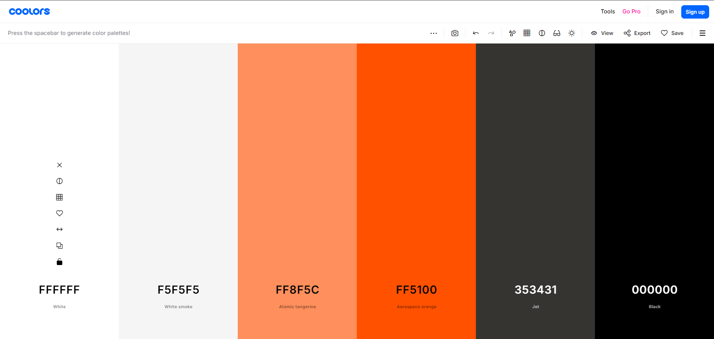

# [JB Fit](https://ci-jb-fit-73ac55dce174.herokuapp.com/)

[](https://github.com/Jordan-Boulton1/peak-performance/commits/main)
[](https://github.com/Jordan-Boulton1/peak-performance/commits/main)
[](https://github.com/Jordan-Boulton1/peak-performance)

Welcome to JB Fit, your ultimate online personal fitness coaching app. JB-Fit is designed to revolutionize the way you approach fitness by providing personalized coaching, comprehensive exercise plans, and a supportive community all in one platform. Whether you're a fitness novice or a seasoned athlete, JB-Fit is here to help you achieve your fitness goals and unlock your peak performance.

### What can you expect?

JB Fit aims to create a centralized and seamless fitness experience that combines expert coaching, tailored exercise & nutrition plans, and a vibrant community. My goal is to make high-quality fitness coaching accessible and affordable to everyone.

### Who do I target?

JB Fit is designed for:

- **Fitness enthusiasts**: Individuals who are passionate about fitness and are looking for structured exercise plans and professional guidance to enhance their workout routines.
- **Beginners**: Those who are new to fitness and need a supportive environment, clear guidance, and easy-to-follow plans to start their journey.
- **Busy Professionals**: People with a hectic schedule who require flexible, personalized coaching that fits into their lifestyle.
- **Fitness Coaches**: Professional coaches who want to reach a wider audience and provide their services through an innovative online platform.

### What benefits do you get?

- **Personalized Coaching**: Receive one-on-one coaching from a fitness expert, tailored to your specific goals and needs. 
- **Personal Check-Ins**: Benefit from regular personal check-ins to ensure you're on track with your fitness goals and receive the support you need to succeed.
- **Custom Exercise Plans**: Get exercise plans specifically designed for you  by a fitness professional. These personalized plans take into account your current fitness level, goals, and preferences, ensuring maximum effectiveness and safety.
- **Tailored Nutrition Plans**: Access personalized nutrition plans that complements your fitness goals. These plans are crafted to meet you dietary preferences and nutritional needs, helping you achieve optimal results.
- **Community Support**: Join a thriving community of like-minded individuals who share your passion for fitness. Engage in forums, share your progress, and support each other.
- **Convenient Payments**: With integrated Stripe payments, purchasing exercise plans and booking coaching sessions is secure and hassle-free.
- **Progress Tracking**: Keep track of your fitness journey with tools to monitor your progress, set new goals, and celebrate your achievements.

JB Fit is more than just a fitness application—it's your partner in achieving a healthier, stronger, and more empowered version of yourself. Take the step towards reaching your peak performance with JB Fit.


source: [amiresponsive](https://ui.dev/amiresponsive?url=https://jb-ci-boutique-ado-0fd50c244260.herokuapp.com)

## UX


When designing this webpage I wanted to achieve a simple, yet welcoming and professional feeling, creating a nice user experience.

### Colour Scheme

The colour scheme for the JB Fit website has been thoughtfully selected to create a visually appealing and effective user experience.

- `#FFFFFF` & `#000000` used interchangeably for primary text and headings.
- `#FF5100` used for primary highlights.
- `#f5f5f5` used as the  primary background colour.
- `#353431` used as the secondary background colour, primarily in the navbar and footer.

I used [coolors.co](https://coolors.co/ffffff-f5f5f5-ff5100-353431-000000) to generate my colour palette.



I've used CSS `:root` variables to easily update the global colour scheme by changing only one value, instead of everywhere in the CSS file.

```css
:root {
--primary-color: #353431;
--primary-color-highlight: #FF5100;
/* Bootstrap overrides */
--bs-body-bg: #f5f5f5;
--bs-body-font-family: 'Cambay', sans-serif;
```

### Typography

- [Montserrat](https://fonts.google.com/specimen/Montserrat) was used for the primary headers and titles.

- [Mukta](https://fonts.google.com/specimen/Mukta) was used for the secondary headers and titles.

- [Cambay](https://fonts.google.com/specimen/Cambay) was used for all other secondary text.

- [Font Awesome](https://fontawesome.com) icons were used throughout the site, such as the social media icons in the footer.
