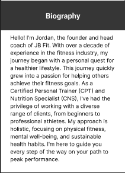
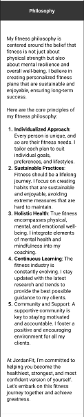
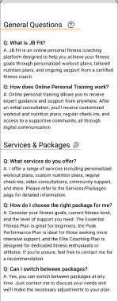
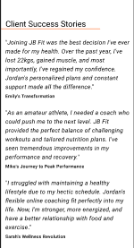

# [JB Fit](https://ci-jb-fit-73ac55dce174.herokuapp.com/)

[](https://github.com/Jordan-Boulton1/peak-performance/commits/main)
[](https://github.com/Jordan-Boulton1/peak-performance/commits/main)
[](https://github.com/Jordan-Boulton1/peak-performance)

Welcome to JB Fit, your ultimate online personal fitness coaching app. JB-Fit is designed to revolutionize the way you approach fitness by providing personalized coaching, comprehensive exercise plans, and a supportive community all in one platform. Whether you're a fitness novice or a seasoned athlete, JB-Fit is here to help you achieve your fitness goals and unlock your peak performance.

### What can you expect?

JB Fit aims to create a centralized and seamless fitness experience that combines expert coaching, tailored exercise & nutrition plans, and a vibrant community. My goal is to make high-quality fitness coaching accessible and affordable to everyone.

### Who do I target?

JB Fit is designed for:

- **Fitness enthusiasts**: Individuals who are passionate about fitness and are looking for structured exercise plans and professional guidance to enhance their workout routines.
- **Beginners**: Those who are new to fitness and need a supportive environment, clear guidance, and easy-to-follow plans to start their journey.
- **Busy Professionals**: People with a hectic schedule who require flexible, personalized coaching that fits into their lifestyle.
- **Fitness Coaches**: Professional coaches who want to reach a wider audience and provide their services through an innovative online platform.

### What benefits do you get?

- **Personalized Coaching**: Receive one-on-one coaching from a fitness expert, tailored to your specific goals and needs. 
- **Personal Check-Ins**: Benefit from regular personal check-ins to ensure you're on track with your fitness goals and receive the support you need to succeed.
- **Custom Exercise Plans**: Get exercise plans specifically designed for you  by a fitness professional. These personalized plans take into account your current fitness level, goals, and preferences, ensuring maximum effectiveness and safety.
- **Tailored Nutrition Plans**: Access personalized nutrition plans that complements your fitness goals. These plans are crafted to meet you dietary preferences and nutritional needs, helping you achieve optimal results.
- **Community Support**: Join a thriving community of like-minded individuals who share your passion for fitness. Engage in forums, share your progress, and support each other.
- **Convenient Payments**: With integrated Stripe payments, purchasing exercise plans and booking coaching sessions is secure and hassle-free.
- **Progress Tracking**: Keep track of your fitness journey with tools to monitor your progress, set new goals, and celebrate your achievements.

JB Fit is more than just a fitness application—it's your partner in achieving a healthier, stronger, and more empowered version of yourself. Take the step towards reaching your peak performance with JB Fit.


source: [amiresponsive](https://ui.dev/amiresponsive?url=https://jb-ci-boutique-ado-0fd50c244260.herokuapp.com)

## UX


When designing this webpage I wanted to achieve a simple, yet welcoming and professional feeling, creating a nice user experience.

### Colour Scheme

The colour scheme for the JB Fit website has been thoughtfully selected to create a visually appealing and effective user experience.

- `#FFFFFF` & `#000000` used interchangeably for primary text and headings.
- `#FF5100` used for primary highlights.
- `#f5f5f5` used as the  primary background colour.
- `#353431` used as the secondary background colour, primarily in the navbar and footer.

I used [coolors.co](https://coolors.co/ffffff-f5f5f5-ff5100-353431-000000) to generate my colour palette.


I've used CSS `:root` variables to easily update the global colour scheme by changing only one value, instead of everywhere in the CSS file.

```css
:root {
--primary-color: #353431;
--primary-color-highlight: #FF5100;
/* Bootstrap overrides */
--bs-body-bg: #f5f5f5;
--bs-body-font-family: 'Cambay', sans-serif;
```

### Typography

- [Montserrat](https://fonts.google.com/specimen/Montserrat) was used for the primary headers and titles.

- [Mukta](https://fonts.google.com/specimen/Mukta) was used for the secondary headers and titles.

- [Cambay](https://fonts.google.com/specimen/Cambay) was used for all other secondary text.

- [Font Awesome](https://fontawesome.com) icons were used throughout the site, such as the social media icons in the footer.

## User Stories

### New Site Users

- As a **new user**, I want to **register and create an account**, so that I can **access personalized fitness and nutrition plans.**
- As a **new user**, I want to **read success stories and testimonials** so that **I can trust the effectiveness of the coaching services.**
- As a **new user**, I want to **be able to message the coach with any queries I have before purchasing a plan**, so that I **can make an informed decision.**

### Registered Site Users

- As a **registered user**, I want to **manage and update my profile information**, so that my **fitness and nutrition plans remain accurate and relevant.**
- As a **registered user**, I want to **securely pay for my selected training package using Stripe**, so that I can **access my plans and coaching services.**
- As a **registered user**, I want to **have regular check-ins and track my progress**, so that **I stay motivated and on track with my fitness goals.**
- As a **registered user**, I want to **access community forums** so that **I can engage with other users and share my experiences.**
- As a **registered user**, I want to **book video consultations with my coach** so that I can **receive personalized guidance and feedback.**
- As a **registered user** that has bought the elite plan, I want access to **exclusive fitness and nutrition workshops** so that I can **deepen my knowledge and skills.**
- As a **registered user**, I want to **understand the cancellation and refund policy** so that I **know what to expect if I need to stop my subscription.**
- As a **registered user**, I want to **contact my coach for support** so that I **can get help when I need it.**

### Site Admin

- As an **admin**, I want to **create, manage and update subscription plans** so that **users can see the up-to-date plans and services at the current time**
- As an **admin**, I want to **view and manage payments** so that **I can keep track of subscription fees and payment statuses.**
- As an **admin**, I want to **manage community content** so that **the forum remains a positive and supportive environment.**
- As an **admin**, I want to **integrate Stripe for handling payments** so that **users can subscribe to plans and make payments securely.**

## Mock-ups

To follow best practice, mockups were developed for this project.
I've used [Figma](https://www.figma.com) to design my site mockups.

### Home Page Mock-ups

<details>
<summary> Click here to see the Home Page Mock-ups</summary>

#### Home
  - 

  - 

  - 

  - 

  - 

  - 

</details>

### About Page Mock-ups

<details>
<summary> Click here to see the About Page Mock-ups</summary>

#### About
  - 
  
  - 

  - 

  - 

  - 

</details>

### Plans Page Mock-ups

<details>
<summary> Click here to see the Plans Page Mock-ups</summary>

#### Plans
  - 

  - 

  - 

</details>

### FAQ Page Mock-ups

<details>
<summary> Click here to see the FAQ Page Mock-ups</summary>

#### FAQ
  - 

  - 

</details>

### Testimonials Page Mock-ups

<details>
<summary> Click here to see the Testimonials Page Mock-ups</summary>

#### Testimonials
  - 

  - 

  - 

  - 

  - 

</details>

## Tools & Technologies Used

- [](https://tim.2bn.dev/markdown-builder) used to generate README and TESTING templates.
- [](https://git-scm.com) used for version control. (`git add`, `git commit`, `git push`)
- [](https://github.com) used for secure online code storage.
- [](https://code.visualstudio.com) used as my local IDE for development.
- [](https://en.wikipedia.org/wiki/HTML) used for the main site content.
- [](https://en.wikipedia.org/wiki/CSS) used for the main site design and layout.
- [](https://www.javascript.com) used for user interaction on the site.
- [](https://jquery.com) used for user interaction on the site.
- [](https://www.python.org) used as the back-end programming language.
- [](https://www.heroku.com) used for hosting the deployed back-end site.
- [](https://getbootstrap.com) used as the front-end CSS framework for modern responsiveness and pre-built components.
- [](https://jestjs.io) used for automated JavaScript testing.
- [](https://www.djangoproject.com) used as the Python framework for the site.
- [](https://www.postgresql.org) used as the relational database management.
- [](https://dbs.ci-dbs.net) used as the Postgres database from Code Institute.
- [](https://www.elephantsql.com) used as the Postgres database.
- [](https://whitenoise.readthedocs.io) used for serving static files with Heroku.
- [](https://stripe.com) used for online secure payments of ecommerce products/services.
- [](https://mail.google.com) used for sending emails in my application.
- [](https://aws.amazon.com/s3) used for online static file storage.
- [](https://www.figma.com) used for creating wireframes.
- [](https://fontawesome.com) used for the icons.
- [](https://chat.openai.com) used to help debug, troubleshoot, and explain things.
- [](https://www.mermaidchart.com/) used for creating ERD diagrams.
- [](https://djecrety.ir/) used for generating django secret keys.
- [](https://www.stackedit.io) used as an in-browser markdown editor.
- [](https://logo.com/) used to create the logo for the website.
- [](https://imageresizer.com/) used compress and resize images.

## Database Design

Entity Relationship Diagrams (ERD) help to visualize database architecture before creating models.
Understanding the relationships between different tables can save time later in the project.


I have used [mermaidchart](https://www.mermaidchart.com/) to generate an ERD.

## Agile Development Process

### GitHub Projects

[GitHub Projects](https://github.com/Jordan-Boulton1/jb-fit/projects?query=is%3Aopen) served as an Agile tool for this project.
It isn't a specialized tool, but with the right tags and project creation/issue assignments, it can be made to work.

Through it, user stories, issues, and milestone tasks were planned, then tracked on a weekly basis using the basic Kanban board.


### GitHub Issues

[GitHub Issues](https://github.com/Jordan-Boulton1/peak-performance/issues) served as an another Agile tool.
There, I used my own **User Story Template** to manage user stories.

It also helped with milestone iterations on a weekly basis.

- [Open Issues](https://github.com/Jordan-Boulton1/peak-performance/issues) [](https://github.com/Jordan-Boulton1/peak-performance/issues)

    

- [Closed Issues](https://github.com/Jordan-Boulton1/peak-performance/issues?q=is%3Aissue+is%3Aclosed) [](https://github.com/Jordan-Boulton1/peak-performance/issues?q=is%3Aissue+is%3Aclosed)

    

### MoSCoW Prioritization

I've decomposed my Epics into stories prior to prioritizing and implementing them.
Using this approach, I was able to apply the MoSCow prioritization and labels to my user stories within the Issues tab.

- **Must Have**: guaranteed to be delivered (*max 60% of stories*)
- **Should Have**: adds significant value, but not vital (*the rest ~20% of stories*)
- **Could Have**: has small impact if left out (*20% of stories*)
- **Won't Have**: not a priority for this iteration

### Milestones

To achieve success in the implementation of this project, I have setup milestones for the end of each week, which represented my "sprints". My approach to solving the business problem in the domain area was to do vertical slicing of the system, instead of horizontal - an approach that I have used so far in my projects. Vertical slicing focuses on ensuring that at the end of each sprint you are able to produce something in the system that is deployable, worthy of a "demo", and that is useable by the client.

