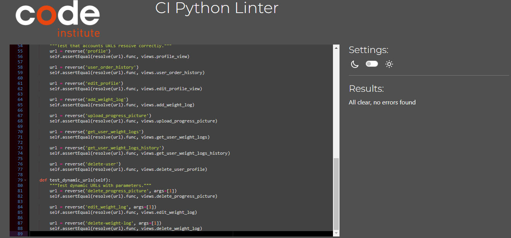
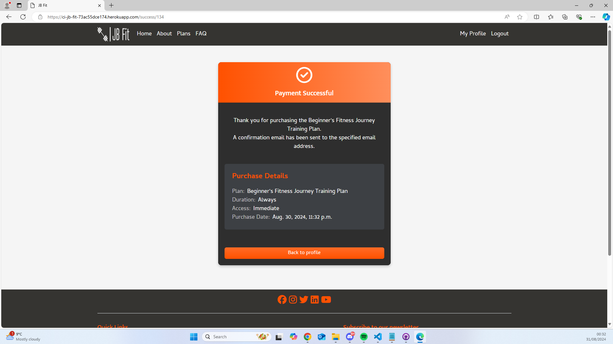

# Testing

> [!NOTE]  
> Return back to the [README.md](README.md) file.

## Code Validation

### HTML

I have used the recommended [HTML W3C Validator](https://validator.w3.org) to validate all of my HTML files.

| Directory | File | Screenshot | Notes |
| --- | --- | --- | --- |
| about | about.html |  | Pass: No Errors |
| accounts | add_weight_log.html |  | Pass: No Errors |
| accounts | edit_profile.html |  | Pass: No Errors |
| accounts | edit_weight_log.html |  | Pass: No Errors |
| accounts | profile.html |  | Pass: No Errors |
| accounts | signup.html |  | I am aware of this error from the validator and is happening due to allauth. I have attempted to remove the `aria-describedby` in the signup form however I was unable to fix it for that reason error will still show up in the validator. |
| checkout | checkout.html |  | Pass: No Errors |
| checkout | checkout_success.html |  | Pass: No Errors |
| contact | contact_form.html |  | Pass: No Errors - Contact form is on every page. |
| faq | faq.html |  | Pass: No Errors |
| home | home.html |  | Pass: No Errors |
| plans | plans.html |  | Pass: No Errors |
| | logout.html |  | Pass: No Errors |
| | login.html |  | Pass: No Errors |
| | password_reset.html |  | Pass: No Errors |
| | password_reset_done.html |  | Pass: No Errors |

### CSS

I have used the recommended [CSS Jigsaw Validator](https://jigsaw.w3.org/css-validator) to validate all of my CSS files.

| Directory | File | Screenshot | Notes |
| --- | --- | --- | --- |
| accounts | profile.css |  | Pass: No Errors |
| checkout | checkout.css |  | Pass: No Errors |
| plans | plans.css |  | Pass: No Errors |
| static | base.css |  | Pass: No Errors |

### Python

I have used the recommended [PEP8 CI Python Linter](https://pep8ci.herokuapp.com) to validate all of my Python files.

| Directory | File | CI URL | Screenshot | Notes |
| --- | --- | --- | --- | --- |
| about | urls.py | [PEP8 CI](https://pep8ci.herokuapp.com/https://raw.githubusercontent.com/Jordan-Boulton1/jb-fit/main/about/urls.py) |  | |
| about | test_urls.py | [PEP8 CI](https://pep8ci.herokuapp.com/https://raw.githubusercontent.com/Jordan-Boulton1/jb-fit/main/about/tests/test_urls.py) |  | |
| about | views.py | [PEP8 CI](https://pep8ci.herokuapp.com/https://raw.githubusercontent.com/Jordan-Boulton1/jb-fit/main/about/views.py) |  | |
| about | test_views.py | [PEP8 CI](https://pep8ci.herokuapp.com/https://raw.githubusercontent.com/Jordan-Boulton1/jb-fit/main/about/tests/test_views.py) |  | |
| accounts | admin.py | [PEP8 CI](https://pep8ci.herokuapp.com/https://raw.githubusercontent.com/Jordan-Boulton1/jb-fit/main/accounts/admin.py) |  | |
| accounts | forms.py | [PEP8 CI](https://pep8ci.herokuapp.com/https://raw.githubusercontent.com/Jordan-Boulton1/jb-fit/main/accounts/forms.py) |  | |
| accounts | models.py | [PEP8 CI](https://pep8ci.herokuapp.com/https://raw.githubusercontent.com/Jordan-Boulton1/jb-fit/main/accounts/models.py) |  | |
| accounts | urls.py | [PEP8 CI](https://pep8ci.herokuapp.com/https://raw.githubusercontent.com/Jordan-Boulton1/jb-fit/main/accounts/urls.py) |  | |
| accounts | views.py | [PEP8 CI](https://pep8ci.herokuapp.com/https://raw.githubusercontent.com/Jordan-Boulton1/jb-fit/main/accounts/views.py) |  | |
| accounts | test_forms.py | [PEP8 CI](https://pep8ci.herokuapp.com/https://raw.githubusercontent.com/Jordan-Boulton1/jb-fit/main/accounts/tests/test_forms.py) |  | |
| accounts | test_models.py | [PEP8 CI](https://pep8ci.herokuapp.com/https://raw.githubusercontent.com/Jordan-Boulton1/jb-fit/main/accounts/tests/test_models.py) |  | |
| accounts | test_urls.py | [PEP8 CI](https://pep8ci.herokuapp.com/https://raw.githubusercontent.com/Jordan-Boulton1/jb-fit/main/accounts/tests/test_urls.py) |  | |
| accounts | test_views.py | [PEP8 CI](https://pep8ci.herokuapp.com/https://raw.githubusercontent.com/Jordan-Boulton1/jb-fit/main/accounts/tests/test_views.py) |  | |
| checkout | forms.py | [PEP8 CI](https://pep8ci.herokuapp.com/https://raw.githubusercontent.com/Jordan-Boulton1/jb-fit/main/checkout/forms.py) |  | |
| checkout | models.py | [PEP8 CI](https://pep8ci.herokuapp.com/https://raw.githubusercontent.com/Jordan-Boulton1/jb-fit/main/checkout/models.py) |  | |
| checkout | urls.py | [PEP8 CI](https://pep8ci.herokuapp.com/https://raw.githubusercontent.com/Jordan-Boulton1/jb-fit/main/checkout/urls.py) |  | |
| checkout | views.py | [PEP8 CI](https://pep8ci.herokuapp.com/https://raw.githubusercontent.com/Jordan-Boulton1/jb-fit/main/checkout/views.py) |  | |
| checkout | webhooks.py | [PEP8 CI](https://pep8ci.herokuapp.com/https://raw.githubusercontent.com/Jordan-Boulton1/jb-fit/main/checkout/webhooks.py) |  | |
| contact | context_processors.py | [PEP8 CI](https://pep8ci.herokuapp.com/https://raw.githubusercontent.com/Jordan-Boulton1/jb-fit/main/contact/context_processors.py) |  | |
| contact | forms.py | [PEP8 CI](https://pep8ci.herokuapp.com/https://raw.githubusercontent.com/Jordan-Boulton1/jb-fit/main/contact/forms.py) |  | |
| contact | models.py | [PEP8 CI](https://pep8ci.herokuapp.com/https://raw.githubusercontent.com/Jordan-Boulton1/jb-fit/main/contact/models.py) |  | |
| contact | urls.py | [PEP8 CI](https://pep8ci.herokuapp.com/https://raw.githubusercontent.com/Jordan-Boulton1/jb-fit/main/contact/urls.py) |  | |
| contact | views.py | [PEP8 CI](https://pep8ci.herokuapp.com/https://raw.githubusercontent.com/Jordan-Boulton1/jb-fit/main/contact/views.py) |  | |
| contact | test_forms.py | [PEP8 CI](https://pep8ci.herokuapp.com/https://raw.githubusercontent.com/Jordan-Boulton1/jb-fit/main/contact/tests/test_forms.py) |  | |
| contact | test_models.py | [PEP8 CI](https://pep8ci.herokuapp.com/https://raw.githubusercontent.com/Jordan-Boulton1/jb-fit/main/contact/tests/test_models.py) |  | |
| contact | test_urls.py | [PEP8 CI](https://pep8ci.herokuapp.com/https://raw.githubusercontent.com/Jordan-Boulton1/jb-fit/main/contact/tests/test_urls.py) |  | |
| contact | test_views.py | [PEP8 CI](https://pep8ci.herokuapp.com/https://raw.githubusercontent.com/Jordan-Boulton1/jb-fit/main/contact/tests/test_views.py) | 
|  | custom_storages.py | [PEP8 CI](https://pep8ci.herokuapp.com/https://raw.githubusercontent.com/Jordan-Boulton1/jb-fit/main/custom_storages.py) |  | |
| faq | urls.py | [PEP8 CI](https://pep8ci.herokuapp.com/https://raw.githubusercontent.com/Jordan-Boulton1/jb-fit/main/faq/urls.py) |  | |
| faq | views.py | [PEP8 CI](https://pep8ci.herokuapp.com/https://raw.githubusercontent.com/Jordan-Boulton1/jb-fit/main/faq/views.py) |  | |
| faq | test_urls.py | [PEP8 CI](https://pep8ci.herokuapp.com/https://raw.githubusercontent.com/Jordan-Boulton1/jb-fit/main/faq/tests/test_urls.py) |  | |
| faq | test_views.py | [PEP8 CI](https://pep8ci.herokuapp.com/https://raw.githubusercontent.com/Jordan-Boulton1/jb-fit/main/faq/tests/test_views.py) |  | |
| jb_fit | settings.py | [PEP8 CI](https://pep8ci.herokuapp.com/https://raw.githubusercontent.com/Jordan-Boulton1/jb-fit/main/jb_fit/settings.py) |  | |
| jb_fit | urls.py | [PEP8 CI](https://pep8ci.herokuapp.com/https://raw.githubusercontent.com/Jordan-Boulton1/jb-fit/main/jb_fit/urls.py) |  | |
|  | manage.py | [PEP8 CI](https://pep8ci.herokuapp.com/https://raw.githubusercontent.com/Jordan-Boulton1/jb-fit/main/manage.py) |  | |
| plans | admin.py | [PEP8 CI](https://pep8ci.herokuapp.com/https://raw.githubusercontent.com/Jordan-Boulton1/jb-fit/main/plans/admin.py) |  | |
| plans | models.py | [PEP8 CI](https://pep8ci.herokuapp.com/https://raw.githubusercontent.com/Jordan-Boulton1/jb-fit/main/plans/models.py) |  | |
| plans | urls.py | [PEP8 CI](https://pep8ci.herokuapp.com/https://raw.githubusercontent.com/Jordan-Boulton1/jb-fit/main/plans/urls.py) |  | |
| plans | views.py | [PEP8 CI](https://pep8ci.herokuapp.com/https://raw.githubusercontent.com/Jordan-Boulton1/jb-fit/main/plans/views.py) |  | |
| plans | test_urls.py | [PEP8 CI](https://pep8ci.herokuapp.com/https://raw.githubusercontent.com/Jordan-Boulton1/jb-fit/main/plans/tests/test_urls.py) |  | |
| plans | test_views.py | [PEP8 CI](https://pep8ci.herokuapp.com/https://raw.githubusercontent.com/Jordan-Boulton1/jb-fit/main/plans/tests/test_views.py) |  | |

## Browser Compatibility

I've tested my deployed project on multiple browsers to check for compatibility issues.

| Browser | Home | About | Plans | FAQ | Profile | Edit Profile | Logout | Login | Register | Checkout | Checkout Success | Notes |
| --- | --- | --- | --- | --- | --- | --- | --- | --- | --- | --- | --- | --- |
| Chrome |  |  |  |  |  |  |  |  |  |  |  | Works as expected |
| Firefox |  |  |  |  |  |  |  |  |  |  |  | Works as expected |
| Edge |  |  |  |  |  |  |  |  |  |  |  | Works as expected |
<<<<<<< Updated upstream
| Safari |  |  |  |  |  |  |  |  |  |  |  | Minor CSS differences |

## Responsiveness

I've tested my deployed project on multiple devices to check for responsiveness issues.

| Device | Home | About | Plans | FAQ | Profile | Edit Profile | Logout | Login | Register | Checkout | Checkout Success | Notes |
| --- | --- | --- | --- | --- | --- | --- | --- | --- | --- | --- | --- | --- |
| Mobile (DevTools) |  |  |  |  |  |  |  |  |  |  |  | Works as expected |
| Tablet (DevTools) |  |  |  |  |  |  |  |  |  |  |  | Works as expected |
| Desktop |  |  |  |  |  |  |  |  |  |  |  | Works as expected |
| iPhone 11 |  |  |  |  |  |  |  |  |  |  |  | Works as expected |
| Safari |  |  |  |  |  |  |  |  |  |  |  | Minor Text Issues |

## Lighthouse Audit

I've tested my deployed project using the Lighthouse Audit tool to check for any major issues.

| Page | Mobile | Desktop | Notes |
| --- | --- | --- | --- |
| Home |  |  | Slow response time due to large images and some minor warnings |
| About |  |  | slow response time due to large images and some minor warnings |
| Plans |  |  | Some minor warnings |
| FAQ |  |  | Some minor warnings |
| Profile |  |  | Some minor warnings |
| Edit Profile |  |  | Some minor warnings |
| Logout |  |  | Some minor warnings |
| Login |  |  | Some minor warnings |
| Register |  |  | Some minor warnings |
| Checkout |  |  | Some minor warnings |
| Checkout Success |  |  | Some minor warnings |

## Automated Testing

I have conducted a series of automated tests on my application.

I fully acknowledge and understand that, in a real-world scenario, an extensive set of additional tests would be more comprehensive.

### Python (Unit Testing)
I have used Django's built-in unit testing framework to test the application functionality.

In order to run the tests, I ran the following command in the terminal each time:

`python manage.py test`

To create the coverage report, I would then run the following commands:

`coverage run manage.py test`

`coverage report`

To see the HTML version of the reports, and find out whether some pieces of code were missing, I ran the following commands:

`coverage html`

`python -m http.server`

Below are the results from the various apps on my application that I've tested:
| App | File | Coverage | Screenshot                                                                                   | 
| --- | --- | --- |----------------------------------------------------------------------------------------------| 
  | about | test_urls.py | 100% |  | 
  | about  | test_views.py | 100% |   |
| accounts | test_models.py | 100% |  | 
  | accounts  | test_forms.py | 98% |   |
| accounts | test_views.py | 71% |   |
| accounts | test_urls.py | 100% |   |
| checkout| test_models.py | 100% |   |
| checkout| test_forms.py | 100% |   |
| checkout| test_views.py | 90% |   |
| checkout| test_urls.py | 100% |   |
| contact| test_models.py | 100% |   |
| contact| test_forms.py | 100% |   |
| contact| test_views.py | 100% |   |
| contact| test_urls.py | 100% |   |
| faq| test_views.py | 100% |   |
| faq| test_urls.py | 100% |   |
| home| test_models.py | 100% |   |
| home| test_forms.py | 100% |   |
| home| test_views.py | 100% |   |
| home| test_urls.py | 100% |   |
| plans| test_models.py | 88% |   |
| plans| test_views.py | 44% |   |
| plans| test_urls.py | 100% |   |
