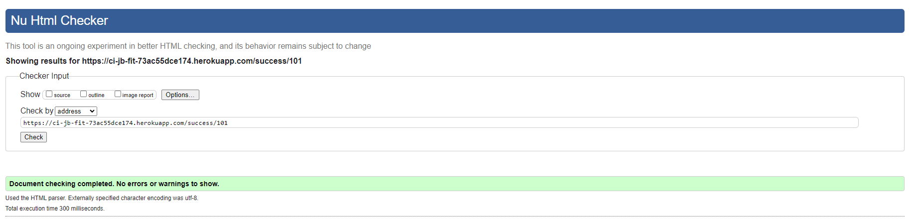

# Testing

> [!NOTE]  
> Return back to the [README.md](README.md) file.

## Code Validation

### HTML

I have used the recommended [HTML W3C Validator](https://validator.w3.org) to validate all of my HTML files.

| Directory | File | Screenshot | Notes |
| --- | --- | --- | --- |
| about | about.html |  | |
| accounts | add_weight_log.html |  | |
| accounts | edit_profile.html |  | |
| accounts | edit_weight_log.html |  | |
| accounts | profile.html |  | |
| checkout | checkout.html |  | |
| checkout | checkout_success.html |  | |
| contact | contact_form.html |  | Contact form is on every page. |
| faq | faq.html |  | |
| home | home.html |  | |
| plans | plans.html |  | |
| | logout.html |  | |
| | login.html |  | |
| | password_reset.html |  | |
| | password_reset_done.html |  | |

### CSS

I have used the recommended [CSS Jigsaw Validator](https://jigsaw.w3.org/css-validator) to validate all of my CSS files.

| Directory | File | Screenshot | Notes |
| --- | --- | --- | --- |
| accounts | profile.css |  | |
| checkout | checkout.css |  | |
| static | base.css |  | |

### Python

I have used the recommended [PEP8 CI Python Linter](https://pep8ci.herokuapp.com) to validate all of my Python files.

| Directory | File | CI URL | Screenshot | Notes |
| --- | --- | --- | --- | --- |
| about | urls.py | [PEP8 CI](https://pep8ci.herokuapp.com/https://raw.githubusercontent.com/Jordan-Boulton1/jb-fit/main/about/urls.py) |  | |
| about | test_urls.py | [PEP8 CI](https://pep8ci.herokuapp.com/https://raw.githubusercontent.com/Jordan-Boulton1/jb-fit/main/about/tests/test_urls.py) |  | |
| about | views.py | [PEP8 CI](https://pep8ci.herokuapp.com/https://raw.githubusercontent.com/Jordan-Boulton1/jb-fit/main/about/views.py) |  | |
| about | test_views.py | [PEP8 CI](https://pep8ci.herokuapp.com/https://raw.githubusercontent.com/Jordan-Boulton1/jb-fit/main/about/tests/test_views.py) |  | |
| accounts | admin.py | [PEP8 CI](https://pep8ci.herokuapp.com/https://raw.githubusercontent.com/Jordan-Boulton1/jb-fit/main/accounts/admin.py) |  | |
| accounts | forms.py | [PEP8 CI](https://pep8ci.herokuapp.com/https://raw.githubusercontent.com/Jordan-Boulton1/jb-fit/main/accounts/forms.py) |  | |
| accounts | models.py | [PEP8 CI](https://pep8ci.herokuapp.com/https://raw.githubusercontent.com/Jordan-Boulton1/jb-fit/main/accounts/models.py) |  | |
| accounts | urls.py | [PEP8 CI](https://pep8ci.herokuapp.com/https://raw.githubusercontent.com/Jordan-Boulton1/jb-fit/main/accounts/urls.py) |  | |
| accounts | views.py | [PEP8 CI](https://pep8ci.herokuapp.com/https://raw.githubusercontent.com/Jordan-Boulton1/jb-fit/main/accounts/views.py) |  | |
| accounts | test_forms.py | [PEP8 CI](https://pep8ci.herokuapp.com/https://raw.githubusercontent.com/Jordan-Boulton1/jb-fit/main/accounts/tests/test_forms.py) |  | |
| accounts | test_models.py | [PEP8 CI](https://pep8ci.herokuapp.com/https://raw.githubusercontent.com/Jordan-Boulton1/jb-fit/main/accounts/tests/test_models.py) |  | |
| accounts | test_urls.py | [PEP8 CI](https://pep8ci.herokuapp.com/https://raw.githubusercontent.com/Jordan-Boulton1/jb-fit/main/accounts/tests/test_urls.py) |  | |
| accounts | test_views.py | [PEP8 CI](https://pep8ci.herokuapp.com/https://raw.githubusercontent.com/Jordan-Boulton1/jb-fit/main/accounts/tests/test_views.py) |  | |
| checkout | forms.py | [PEP8 CI](https://pep8ci.herokuapp.com/https://raw.githubusercontent.com/Jordan-Boulton1/jb-fit/main/checkout/forms.py) |  | |
| checkout | models.py | [PEP8 CI](https://pep8ci.herokuapp.com/https://raw.githubusercontent.com/Jordan-Boulton1/jb-fit/main/checkout/models.py) |  | |
| checkout | urls.py | [PEP8 CI](https://pep8ci.herokuapp.com/https://raw.githubusercontent.com/Jordan-Boulton1/jb-fit/main/checkout/urls.py) |  | |
| checkout | views.py | [PEP8 CI](https://pep8ci.herokuapp.com/https://raw.githubusercontent.com/Jordan-Boulton1/jb-fit/main/checkout/views.py) |  | |
| checkout | webhooks.py | [PEP8 CI](https://pep8ci.herokuapp.com/https://raw.githubusercontent.com/Jordan-Boulton1/jb-fit/main/checkout/webhooks.py) |  | |
| contact | context_processors.py | [PEP8 CI](https://pep8ci.herokuapp.com/https://raw.githubusercontent.com/Jordan-Boulton1/jb-fit/main/contact/context_processors.py) |  | |
| contact | forms.py | [PEP8 CI](https://pep8ci.herokuapp.com/https://raw.githubusercontent.com/Jordan-Boulton1/jb-fit/main/contact/forms.py) |  | |
| contact | models.py | [PEP8 CI](https://pep8ci.herokuapp.com/https://raw.githubusercontent.com/Jordan-Boulton1/jb-fit/main/contact/models.py) |  | |
| contact | urls.py | [PEP8 CI](https://pep8ci.herokuapp.com/https://raw.githubusercontent.com/Jordan-Boulton1/jb-fit/main/contact/urls.py) |  | |
| contact | views.py | [PEP8 CI](https://pep8ci.herokuapp.com/https://raw.githubusercontent.com/Jordan-Boulton1/jb-fit/main/contact/views.py) |  | |
| contact | test_forms.py | [PEP8 CI](https://pep8ci.herokuapp.com/https://raw.githubusercontent.com/Jordan-Boulton1/jb-fit/main/contact/tests/test_forms.py) |  | |
| contact | test_models.py | [PEP8 CI](https://pep8ci.herokuapp.com/https://raw.githubusercontent.com/Jordan-Boulton1/jb-fit/main/contact/tests/test_models.py) |  | |
| contact | test_urls.py | [PEP8 CI](https://pep8ci.herokuapp.com/https://raw.githubusercontent.com/Jordan-Boulton1/jb-fit/main/contact/tests/test_urls.py) |  | |
| contact | test_views.py | [PEP8 CI](https://pep8ci.herokuapp.com/https://raw.githubusercontent.com/Jordan-Boulton1/jb-fit/main/contact/tests/test_views.py) | 
|  | custom_storages.py | [PEP8 CI](https://pep8ci.herokuapp.com/https://raw.githubusercontent.com/Jordan-Boulton1/jb-fit/main/custom_storages.py) |  | |
| faq | urls.py | [PEP8 CI](https://pep8ci.herokuapp.com/https://raw.githubusercontent.com/Jordan-Boulton1/jb-fit/main/faq/urls.py) |  | |
| faq | views.py | [PEP8 CI](https://pep8ci.herokuapp.com/https://raw.githubusercontent.com/Jordan-Boulton1/jb-fit/main/faq/views.py) |  | |
| faq | test_urls.py | [PEP8 CI](https://pep8ci.herokuapp.com/https://raw.githubusercontent.com/Jordan-Boulton1/jb-fit/main/faq/tests/test_urls.py) |  | |
| faq | test_views.py | [PEP8 CI](https://pep8ci.herokuapp.com/https://raw.githubusercontent.com/Jordan-Boulton1/jb-fit/main/faq/tests/test_views.py) |  | |