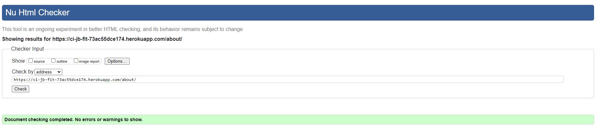
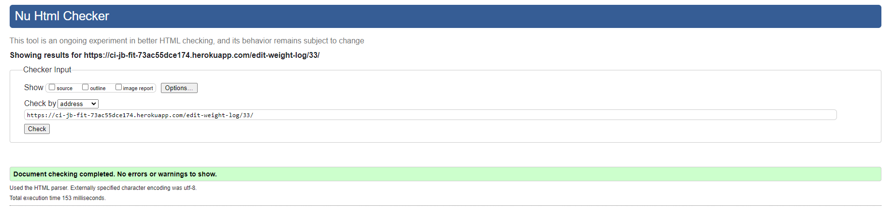

# Testing

> [!NOTE]  
> Return back to the [README.md](README.md) file.

## Code Validation

### HTML

I have used the recommended [HTML W3C Validator](https://validator.w3.org) to validate all of my HTML files.

| Directory | File | Screenshot | Notes |
| --- | --- | --- | --- |
| about | about.html |  | |
| accounts | add_weight_log.html |  | |
| accounts | edit_profile.html |  | |
| accounts | edit_weight_log.html |  | |
| accounts | profile.html |  | |
| checkout | checkout.html |  | |
| checkout | checkout_success.html |  | |
| contact | contact_form.html |  | Contact form is on every page. |
| faq | faq.html |  | |
| home | home.html |  | |
| plans | plans.html |  | |
| | logout.html |  | |
| | login.html |  | |
| | password_reset.html |  | |
| | password_reset_done.html |  | |