# Testing

> [!NOTE]  
> Return back to the [README.md](README.md) file.

## Code Validation

### HTML

I have used the recommended [HTML W3C Validator](https://validator.w3.org) to validate all of my HTML files.

| Directory | File | Screenshot | Notes |
| --- | --- | --- | --- |
| about | about.html |  | Pass: No Errors |
| accounts | add_weight_log.html |  | Pass: No Errors |
| accounts | edit_profile.html |  | Pass: No Errors |
| accounts | edit_weight_log.html |  | Pass: No Errors |
| accounts | profile.html |  | Pass: No Errors |
| accounts | signup.html |  | I am aware of this error from the validator and is happening due to allauth. I have attempted to remove the `aria-describedby` in the signup form however I was unable to fix it for that reason error will still show up in the validator. |
| checkout | checkout.html |  | Pass: No Errors |
| checkout | checkout_success.html |  | Pass: No Errors |
| contact | contact_form.html |  | Pass: No Errors - Contact form is on every page. |
| faq | faq.html |  | Pass: No Errors |
| home | home.html |  | Pass: No Errors |
| plans | plans.html |  | Pass: No Errors |
| | logout.html |  | Pass: No Errors |
| | login.html |  | Pass: No Errors |
| | password_reset.html |  | Pass: No Errors |
| | password_reset_done.html |  | Pass: No Errors |

### CSS

I have used the recommended [CSS Jigsaw Validator](https://jigsaw.w3.org/css-validator) to validate all of my CSS files.

| Directory | File | Screenshot | Notes |
| --- | --- | --- | --- |
| accounts | profile.css |  | Pass: No Errors |
| checkout | checkout.css |  | Pass: No Errors |
| plans | plans.css |  | Pass: No Errors |
| static | base.css |  | Pass: No Errors |

### JavaScript

I have used the recommended [JShint Validator](https://jshint.com) to validate all of my JS files.

| Directory | File | Screenshot | Notes |
| --- | --- | --- | --- |
| accounts/js | edit_profile.js |  | |
| accounts/js | profile.js |  | `myChart` ***on line 39***: Although flagged as unused, `myChart` is actually used when creating the chart, and while it's not directly interacted with after its creation, it serves the purpose of initializing the chart in the DOM. This variable is required to properly display the chart but doesn't need to be referenced again unless you plan to manipulate the chart later (e.g., update data, destroy the chart). JSHint’s warning is just a result of it not seeing further use in the scope.  `editWeightLog` ***on line 112***: This function is defined but not directly called in the script file; however, it's used as an event handler for dynamically generated DOM elements. Specifically, it's assigned to the "Edit" button for each row in the weight logs table. The function needs to be accessible in the global scope because the buttons are dynamically inserted into the DOM, and the event listeners are set directly in the HTML generated by JavaScript.  `deleteWeightLog` ***on line 156***: Similar to `editWeightLog`, the `deleteWeightLog` function is used as an event handler for dynamically created "Delete" buttons in the table. These buttons are generated when the `loadLogHistory` function runs, and each button calls this function when clicked. JSHint flags it because it doesn't see the call within the script, but it’s actually called via the dynamically generated elements. |
| accounts/js/tests| editprofile.test.js |  | |
| accounts/js/tests| profile.test.js |  | |
| checkout/js | stripe_elements.js |  | |
| static/js | base.js |  | |
| static/js/tests | base.js |  | |

### Python

I have used the recommended [PEP8 CI Python Linter](https://pep8ci.herokuapp.com) to validate all of my Python files.

| Directory | File | CI URL | Screenshot | Notes |
| --- | --- | --- | --- | --- |
| about | urls.py | [PEP8 CI](https://pep8ci.herokuapp.com/https://raw.githubusercontent.com/Jordan-Boulton1/jb-fit/main/about/urls.py) |  | Pass: No Errors |
| about | test_urls.py | [PEP8 CI](https://pep8ci.herokuapp.com/https://raw.githubusercontent.com/Jordan-Boulton1/jb-fit/main/about/tests/test_urls.py) | 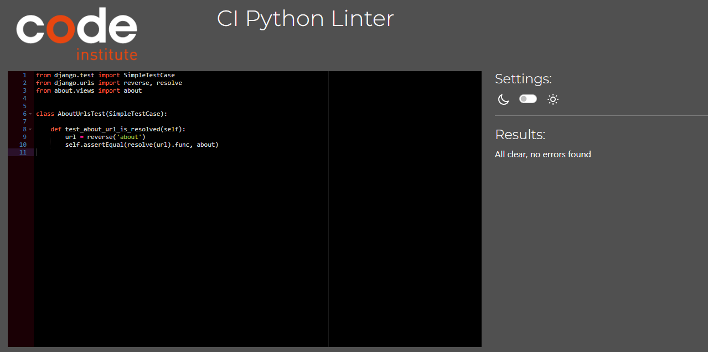 | Pass: No Errors |
| about | views.py | [PEP8 CI](https://pep8ci.herokuapp.com/https://raw.githubusercontent.com/Jordan-Boulton1/jb-fit/main/about/views.py) |  | Pass: No Errors |
| about | test_views.py | [PEP8 CI](https://pep8ci.herokuapp.com/https://raw.githubusercontent.com/Jordan-Boulton1/jb-fit/main/about/tests/test_views.py) |  | Pass: No Errors |
| accounts | admin.py | [PEP8 CI](https://pep8ci.herokuapp.com/https://raw.githubusercontent.com/Jordan-Boulton1/jb-fit/main/accounts/admin.py) |  | Pass: No Errors |
| accounts | forms.py | [PEP8 CI](https://pep8ci.herokuapp.com/https://raw.githubusercontent.com/Jordan-Boulton1/jb-fit/main/accounts/forms.py) |  | Pass: No Errors |
| accounts | models.py | [PEP8 CI](https://pep8ci.herokuapp.com/https://raw.githubusercontent.com/Jordan-Boulton1/jb-fit/main/accounts/models.py) |  | Pass: No Errors |
| accounts | urls.py | [PEP8 CI](https://pep8ci.herokuapp.com/https://raw.githubusercontent.com/Jordan-Boulton1/jb-fit/main/accounts/urls.py) |  | Pass: No Errors |
| accounts | views.py | [PEP8 CI](https://pep8ci.herokuapp.com/https://raw.githubusercontent.com/Jordan-Boulton1/jb-fit/main/accounts/views.py) |  | Pass: No Errors |
| accounts | test_forms.py | [PEP8 CI](https://pep8ci.herokuapp.com/https://raw.githubusercontent.com/Jordan-Boulton1/jb-fit/main/accounts/tests/test_forms.py) |  | Pass: No Errors |
| accounts | test_models.py | [PEP8 CI](https://pep8ci.herokuapp.com/https://raw.githubusercontent.com/Jordan-Boulton1/jb-fit/main/accounts/tests/test_models.py) |  | Pass: No Errors |
| accounts | test_urls.py | [PEP8 CI](https://pep8ci.herokuapp.com/https://raw.githubusercontent.com/Jordan-Boulton1/jb-fit/main/accounts/tests/test_urls.py) |  | Pass: No Errors |
| accounts | test_views.py | [PEP8 CI](https://pep8ci.herokuapp.com/https://raw.githubusercontent.com/Jordan-Boulton1/jb-fit/main/accounts/tests/test_views.py) |  | Pass: No Errors |
| checkout | forms.py | [PEP8 CI](https://pep8ci.herokuapp.com/https://raw.githubusercontent.com/Jordan-Boulton1/jb-fit/main/checkout/forms.py) |  | Pass: No Errors |
| checkout | models.py | [PEP8 CI](https://pep8ci.herokuapp.com/https://raw.githubusercontent.com/Jordan-Boulton1/jb-fit/main/checkout/models.py) |  | Pass: No Errors |
| checkout | urls.py | [PEP8 CI](https://pep8ci.herokuapp.com/https://raw.githubusercontent.com/Jordan-Boulton1/jb-fit/main/checkout/urls.py) |  | Pass: No Errors |
| checkout | views.py | [PEP8 CI](https://pep8ci.herokuapp.com/https://raw.githubusercontent.com/Jordan-Boulton1/jb-fit/main/checkout/views.py) |  | Pass: No Errors |
| checkout | webhooks.py | [PEP8 CI](https://pep8ci.herokuapp.com/https://raw.githubusercontent.com/Jordan-Boulton1/jb-fit/main/checkout/webhooks.py) |  | Pass: No Errors |
| checkout | test_forms.py | [PEP8 CI](https://pep8ci.herokuapp.com/https://raw.githubusercontent.com/Jordan-Boulton1/jb-fit/main/checkout/tests/test_forms.py) |  | Pass: No Errors |
| checkout | test_models.py | [PEP8 CI](https://pep8ci.herokuapp.com/https://raw.githubusercontent.com/Jordan-Boulton1/jb-fit/main/checkout/tests/test_models.py) |  | Pass: No Errors |
| checkout | test_urls.py | [PEP8 CI](https://pep8ci.herokuapp.com/https://raw.githubusercontent.com/Jordan-Boulton1/jb-fit/main/checkout/tests/test_urls.py) |  | Pass: No Errors |
| checkout | test_views.py | [PEP8 CI](https://pep8ci.herokuapp.com/https://raw.githubusercontent.com/Jordan-Boulton1/jb-fit/main/checkout/tests/test_views.py) |  | Pass: No Errors |
| contact | context_processors.py | [PEP8 CI](https://pep8ci.herokuapp.com/https://raw.githubusercontent.com/Jordan-Boulton1/jb-fit/main/contact/context_processors.py) |  | Pass: No Errors |
| contact | forms.py | [PEP8 CI](https://pep8ci.herokuapp.com/https://raw.githubusercontent.com/Jordan-Boulton1/jb-fit/main/contact/forms.py) |  | Pass: No Errors |
| contact | models.py | [PEP8 CI](https://pep8ci.herokuapp.com/https://raw.githubusercontent.com/Jordan-Boulton1/jb-fit/main/contact/models.py) |  | Pass: No Errors |
| contact | urls.py | [PEP8 CI](https://pep8ci.herokuapp.com/https://raw.githubusercontent.com/Jordan-Boulton1/jb-fit/main/contact/urls.py) |  | Pass: No Errors |
| contact | views.py | [PEP8 CI](https://pep8ci.herokuapp.com/https://raw.githubusercontent.com/Jordan-Boulton1/jb-fit/main/contact/views.py) |  | Pass: No Errors |
| contact | test_forms.py | [PEP8 CI](https://pep8ci.herokuapp.com/https://raw.githubusercontent.com/Jordan-Boulton1/jb-fit/main/contact/tests/test_forms.py) |  | Pass: No Errors |
| contact | test_models.py | [PEP8 CI](https://pep8ci.herokuapp.com/https://raw.githubusercontent.com/Jordan-Boulton1/jb-fit/main/contact/tests/test_models.py) |  | Pass: No Errors |
| contact | test_urls.py | [PEP8 CI](https://pep8ci.herokuapp.com/https://raw.githubusercontent.com/Jordan-Boulton1/jb-fit/main/contact/tests/test_urls.py) |  | Pass: No Errors |
| contact | test_views.py | [PEP8 CI](https://pep8ci.herokuapp.com/https://raw.githubusercontent.com/Jordan-Boulton1/jb-fit/main/contact/tests/test_views.py) |  | Pass: No Errors |
|  | custom_storages.py | [PEP8 CI](https://pep8ci.herokuapp.com/https://raw.githubusercontent.com/Jordan-Boulton1/jb-fit/main/custom_storages.py) |  | Pass: No Errors |
| faq | urls.py | [PEP8 CI](https://pep8ci.herokuapp.com/https://raw.githubusercontent.com/Jordan-Boulton1/jb-fit/main/faq/urls.py) |  | Pass: No Errors |
| faq | views.py | [PEP8 CI](https://pep8ci.herokuapp.com/https://raw.githubusercontent.com/Jordan-Boulton1/jb-fit/main/faq/views.py) |  | Pass: No Errors |
| faq | test_urls.py | [PEP8 CI](https://pep8ci.herokuapp.com/https://raw.githubusercontent.com/Jordan-Boulton1/jb-fit/main/faq/tests/test_urls.py) |  | Pass: No Errors |
| faq | test_views.py | [PEP8 CI](https://pep8ci.herokuapp.com/https://raw.githubusercontent.com/Jordan-Boulton1/jb-fit/main/faq/tests/test_views.py) |  | Pass: No Errors |
| jb_fit | settings.py | [PEP8 CI](https://pep8ci.herokuapp.com/https://raw.githubusercontent.com/Jordan-Boulton1/jb-fit/main/jb_fit/settings.py) |  | Pass: No Errors |
| jb_fit | urls.py | [PEP8 CI](https://pep8ci.herokuapp.com/https://raw.githubusercontent.com/Jordan-Boulton1/jb-fit/main/jb_fit/urls.py) |  | Pass: No Errors |
|  | manage.py | [PEP8 CI](https://pep8ci.herokuapp.com/https://raw.githubusercontent.com/Jordan-Boulton1/jb-fit/main/manage.py) |  | Pass: No Errors |
| plans | admin.py | [PEP8 CI](https://pep8ci.herokuapp.com/https://raw.githubusercontent.com/Jordan-Boulton1/jb-fit/main/plans/admin.py) |  | Pass: No Errors |
| plans | models.py | [PEP8 CI](https://pep8ci.herokuapp.com/https://raw.githubusercontent.com/Jordan-Boulton1/jb-fit/main/plans/models.py) |  | Pass: No Errors |
| plans | urls.py | [PEP8 CI](https://pep8ci.herokuapp.com/https://raw.githubusercontent.com/Jordan-Boulton1/jb-fit/main/plans/urls.py) |  | Pass: No Errors |
| plans | views.py | [PEP8 CI](https://pep8ci.herokuapp.com/https://raw.githubusercontent.com/Jordan-Boulton1/jb-fit/main/plans/views.py) |  | Pass: No Errors |
| plans | test_urls.py | [PEP8 CI](https://pep8ci.herokuapp.com/https://raw.githubusercontent.com/Jordan-Boulton1/jb-fit/main/plans/tests/test_urls.py) |  | Pass: No Errors |
| plans | test_views.py | [PEP8 CI](https://pep8ci.herokuapp.com/https://raw.githubusercontent.com/Jordan-Boulton1/jb-fit/main/plans/tests/test_views.py) |  | Pass: No Errors |

## Browser Compatibility

I've tested my deployed project on multiple browsers to check for compatibility issues.

| Browser | Home | About | Plans | FAQ | Profile | Edit Profile | Logout | Login | Register | Checkout | Checkout Success | Notes |
| --- | --- | --- | --- | --- | --- | --- | --- | --- | --- | --- | --- | --- |
| Chrome |  |  |  |  |  |  |  |  |  |  |  | Works as expected |
| Firefox |  |  |  |  |  |  |  |  |  |  |  | Works as expected |
| Edge |  |  |  |  |  |  |  |  |  |  |  | Works as expected |
| Safari |  |  |  |  |  |  |  |  |  |  |  | Minor CSS differences |

## Responsiveness

I've tested my deployed project on multiple devices to check for responsiveness issues.

| Device | Home | About | Plans | FAQ | Profile | Edit Profile | Logout | Login | Register | Checkout | Checkout Success | Notes |
| --- | --- | --- | --- | --- | --- | --- | --- | --- | --- | --- | --- | --- |
| Mobile (DevTools) |  |  |  |  |  |  |  |  |  |  |  | Works as expected |
| Tablet (DevTools) |  |  |  |  |  |  |  |  | 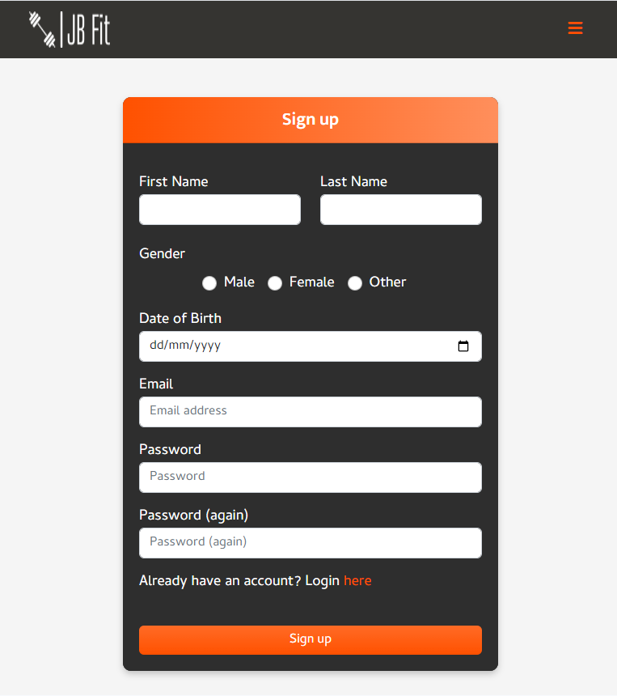 |  |  | Works as expected |
| Desktop |  |  | 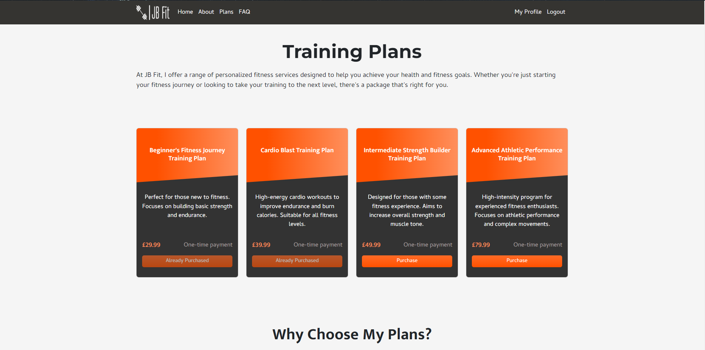 |  |  |  |  |  |  |  |  | Works as expected |
| iPhone 11 |  |  |  |  |  |  |  |  |  |  |  | Works as expected |
| Safari |  |  |  |  |  |  |  |  |  |  |  | Minor Text Issues |

## Lighthouse Audit

I've tested my deployed project using the Lighthouse Audit tool to check for any major issues.

| Page | Mobile | Desktop | Notes |
| --- | --- | --- | --- |
| Home |  |  | Slow response time due to large images and some minor warnings |
| About |  |  | slow response time due to large images and some minor warnings |
| Plans |  |  | Some minor warnings |
| FAQ |  |  | Some minor warnings |
| Profile |  |  | Some minor warnings |
| Edit Profile |  |  | Some minor warnings |
| Logout |  |  | Some minor warnings |
| Login |  |  | Some minor warnings |
| Register |  |  | Some minor warnings |
| Checkout |  |  | Some minor warnings |
| Checkout Success |  |  | Some minor warnings |

## Defensive Programming

Defensive programming was manually tested with the below user acceptance testing:

| Page | Expectation | Test | Result | Fix | Screenshot |
| --- | --- | --- | --- | --- | --- |
| All Pages | | | | | |
| | Navigation for authenticated users should show "My Profile" and "Logout". | Logged in as an authenticated user. | The navigation correctly displayed "My Profile" and "Logout". | Test concluded and passed |  |
| | The footer should contain quick links, social media icons, and a newsletter subscription form. | Checked the footer section. | The footer displayed all expected elements: quick links, social media icons, and a newsletter form. | Test concluded and passed | 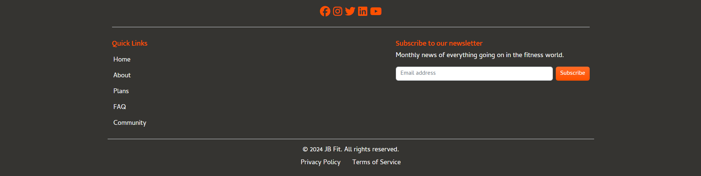 |
| | Logo should be visible on the header. | Loaded the homepage. | The logo was displayed as expected in the header section. | Test concluded and passed. |  |
| | Newsletter subscription form should accept input and provide feedback | Entered an email address in the newsletter form. | The form accepted the input, and feedback was provided upon submission. | Test concluded and passed. |  |
| | Quick links should be visible and clickable in the footer. | Tested each quick link by clicking on it. | All quick links navigated to their respective pages correctly. | Test concluded and passed. | 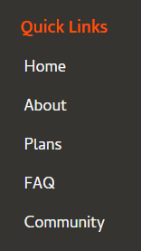 |
| | Responsive navigation should adjust for smaller screens with a toggle menu. | Resized the browser window to a smaller width. | The navigation adjusted and displayed a toggle menu correctly. | Test concluded and passed. |  |
| | Responsive navigation should expand to show links when the menu is toggled. | Clicked on the menu toggle. | The navigation expanded and displayed all links as expected. | Test concluded and passed. |  |
| | Social media links should be visible and linked correctly in the footer. | Clicked on each social media icon. | Each icon correctly linked to the corresponding social media page. | Test concluded and passed. |  |
| | Navigation for unauthenticated users should show "Login" and "Register". | Logged out and viewed the home page. | The navigation correctly displayed "Login" and "Register" for unauthenticated users. | Test concluded and passed. |  |
| | The contact form should prefill the first name, last name, and email fields if the user is authenticated. | Tested by logging in as an authenticated user and visiting the contact form. | The form fields were correctly prefilled with the authenticated user's details. | Test concluded and passed. |  |
| | The form must allow users to submit a message and display a notification that their message has been sent. | Filled out the message field and submitted the form. | The message was submitted successfully, and a confirmation notification was displayed. | Test concluded and passed. |  |
| Home | | | | | |
| | The hero section should display a clear, motivational message with an appropriate background. | Checked hero section on page load. | The hero section displayed correctly with text and image. | Test concluded and passed. |  |
| | The 'About Me' section should provide details about the coach with a suitable image. | Viewed the 'About Me' section. | The section displayed correctly with text and image aligned as expected. | Test concluded and passed. |  |
| | The 'What is Online Personal Training?' section should list benefits clearly. | Reviewed the benefits section. | The section displayed benefits with icons and descriptions clearly visible. | Test concluded and passed. | 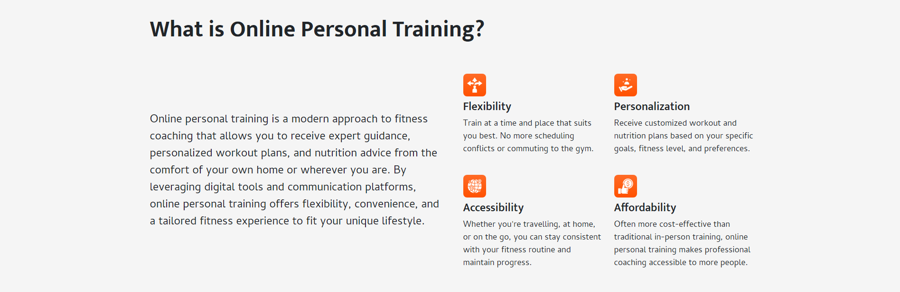 |
| | The process steps should be outlined clearly with distinct icons and descriptions. | Checked the 'How it Works' section. | Each step was correctly displayed with appropriate descriptions and icons. | Test concluded and passed. | 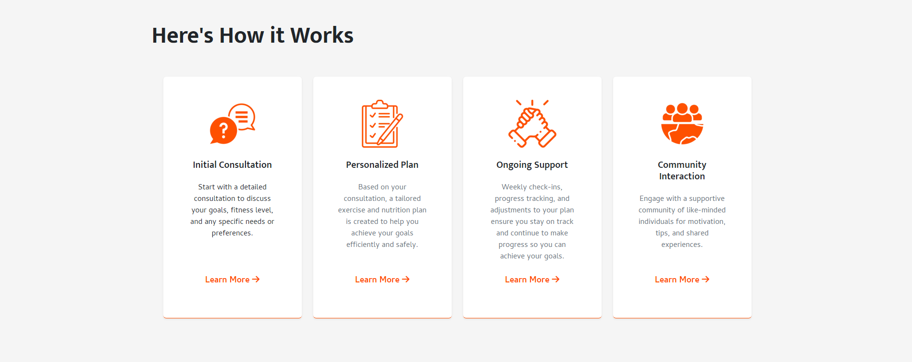 |
| | The 'Client Reviews' section should showcase client feedback with images and ratings. | Viewed client reviews on the homepage. | Client reviews displayed correctly with images, text, and star ratings as expected. | Test concluded and passed. |  |
| | The 'Discover Our Premium Training Plans' should offer a clear call to action button. | Checked the training plans section. | Section displayed as expected with bullet points and a prominent call to action button. | Test concluded and passed. |  |
| | The call to action button labeled "Find out more" should redirect users to the plans page where they can explore available training plans. | Clicked the "Find out more" button in the training plans section. | The call to action button successfully redirected to the plans page, displaying all available training options. | Test concluded and passed. |  |
| About | | | | | |
| | The hero section on the "About" page should display a motivational quote with an appropriate background image. | Checked hero section on the "About" page. | The hero section displayed correctly with the quote and background image as expected. | Test concluded and passed. |  |
| | The "Coach Biography" section should clearly display information about the coach’s background, experience, and qualifications. | Reviewed the "Coach Biography" section on the "About" page. | The biography displayed correctly with text and highlighted key points as expected. | Test concluded and passed. |  |
| | The "Mission and Vision" section should display the mission and vision statements side by side, clearly communicating the goals and values of JB Fit. | Reviewed the "Mission and Vision" section on the "About" page. | The section displayed the mission and vision statements correctly, side by side, as expected. | Test concluded and passed. | 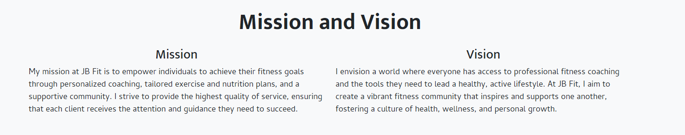 |
| | The "Personal Fitness Philosophy" section should clearly present the coach's fitness philosophy with supporting pillars like Individualized Approach, Sustainable Practices, Holistic Health, Continuous Learning, and Community and Support. | Reviewed the "Personal Fitness Philosophy" section on the "About" page. | The section displayed the fitness philosophy and its supporting pillars clearly, with proper alignment and readability. | Test concluded and passed. |  |
| Plans | | | | | |
| | If the user is unauthenticated and clicks "Purchase," they should be redirected to the login page. | Tested by clicking "Purchase" as an unauthenticated user. | The user was redirected to the login page as expected. | Test concluded and passed. | 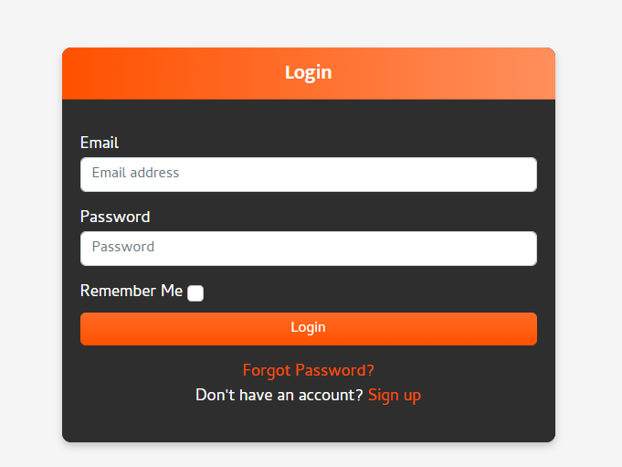 |
| | If the user is authenticated and clicks "Purchase," they should be redirected to the checkout page. | Tested by clicking "Purchase" as an authenticated user. | The user was redirected to the checkout page correctly. | Test concluded and passed. | 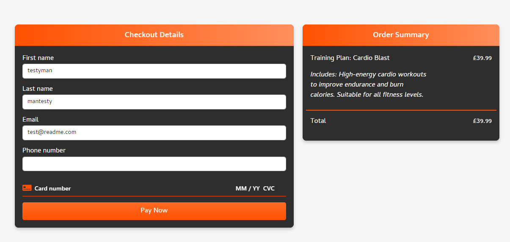 | 
| | If the user has already purchased a specific plan, the plan button should appear dulled and say "Already Purchased" with a message on hover: "You have already purchased this training plan." | Viewed purchased plans as an authenticated user. Hovered over dulled button. | The purchased plan button appeared dulled in color, and the hover message displayed correctly as expected. | Test concluded and passed. |  |
| | The "Why Choose My Plans?" section should display four key reasons: Expertise, Customization, Support, and Results, each with a corresponding icon and description. | Reviewed the "Why Choose My Plans?" section on the page. | The section displayed the four key reasons clearly with icons and descriptions aligned as expected. | Test concluded and passed. |  |
| FAQ | | | | | |
| | The "Frequently Asked Questions" section should display a list of questions with expandable accordion items for each category. The questions should expand to show the answers when clicked. | Clicked on different FAQ categories and questions to expand them. | The FAQ section displayed correctly with expandable accordion items, showing answers upon clicking. | Test concluded and passed. |  |
| Login | | | | | |
| | The login form should accept email and password inputs, have a "Remember Me" option, and provide links to "Forgot Password?" and "Sign up." | Tested the login form with valid and invalid credentials, and clicked on both links. | The form accepted inputs as expected. On invalid login, an error message was displayed; "Forgot Password?" and "Sign up" links redirected correctly. | Test concluded and passed. |  |
| | If login credentials are incorrect, an error message should appear indicating that the email or password is incorrect. | Submitted incorrect login details. | An error message appeared correctly indicating that the email address or password was incorrect. | Test concluded and passed. | 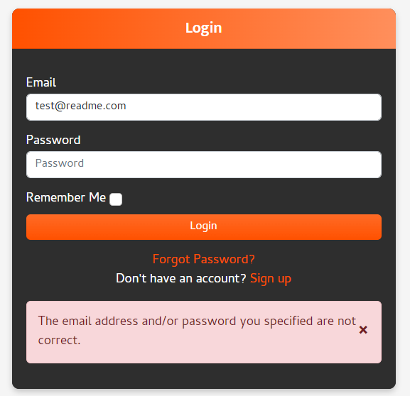 |
| | The "Forgot Password?" link should redirect to the password reset page. | Clicked the "Forgot Password?" link. | The link redirected correctly to the password reset page. | Test concluded and passed. |  |
| | The "Sign up" link should redirect to the registration page. | Clicked the "Sign up" link. | The link redirected correctly to the registration page. | Test concluded and passed. | 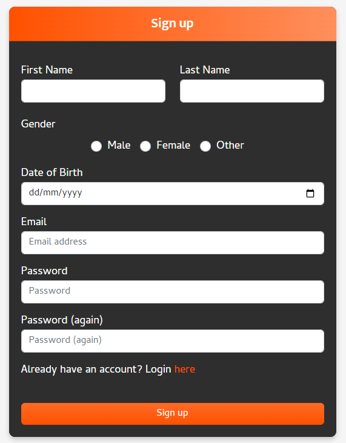 |
| | After requesting a password reset, the user should be shown a confirmation message instructing them to check their email. | Requested a password reset with a valid email. | The confirmation message was displayed, advising the user to check their inbox and spam folder for the reset link. | Test concluded and passed. | 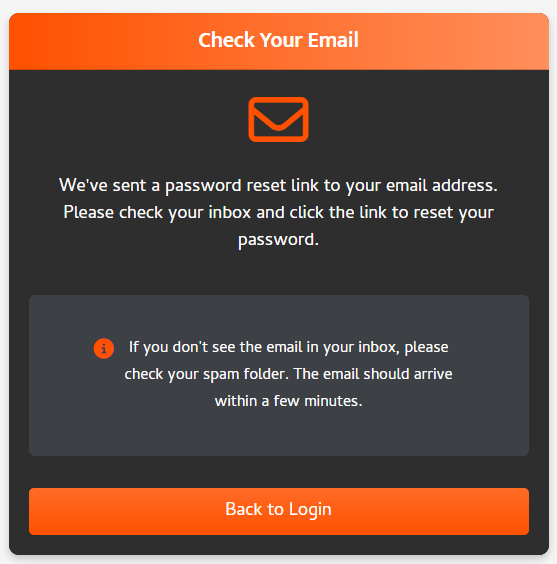 |
| | The email should inform the user that a reset request was made, provide instructions if the email is not associated with an account, and include a link to sign up if needed. | Checked the actual email received after requesting a password reset with a non-registered email. | The email correctly notified the user that no account exists with the provided email and offered a sign-up link. | Test concluded and passed. |  |
| Sign Up | | | | | |
| | The sign-up form should allow users to enter their first name, last name, gender, date of birth, email, and password twice, and should validate all fields correctly. | Filled out the sign-up form with various inputs, including missing fields and existing email. | The form correctly validated the required fields and displayed error messages for missing inputs and existing email addresses. | Test concluded and passed. |  |
| | If the user tries to sign up with an email that already exists, they should receive a message indicating that the email is already registered, and there should be an option to redirect to the login page. | Attempted to sign up using an already registered email. | A validation message appeared stating "A user is already registered with this email address," and the user was prompted to log in instead. | Test concluded and passed. |  |
| | The "Date of Birth" field should use a date picker to allow users to select their birth date, ensuring the date format is correct (dd/mm/yyyy). | Clicked on the "Date of Birth" field to test the date picker functionality. | The date picker appeared correctly, allowing the selection of dates in the proper format. | Test concluded and passed. |  |
| | The "Login" link in the sign-up form should redirect users to the login page if they already have an account. | Clicked the "Login" link on the sign-up form. | The link correctly redirected to the login page as expected. | Test concluded and passed. |  |
| Logout | | | | | |
| | The "Logout" confirmation dialog should prompt the user to confirm their intention to log out, with "Logout" and "Cancel" buttons. | Clicked on the "Logout" button to test the confirmation dialog. | The confirmation dialog appeared correctly, asking if the user wants to log out. Both "Logout" and "Cancel" buttons functioned as expected. | Test concluded and passed. |  |
| | After confirming logout, the user should be redirected to the homepage, displaying a sign-out confirmation message. | Confirmed the logout and observed the redirection process. | The user was successfully redirected to the homepage with a green notification banner stating "You have signed out." The navigation bar updated to show "Login" and "Register" options. | Test concluded and passed. |  |
| Profile | | | | | |
| | A warning message should appear if the user’s profile is incomplete, listing missing fields (e.g., Address, Phone Number, Current Weight, Goal Weight, Height). | Reviewed the profile overview page with incomplete profile data. | A warning banner correctly appeared at the top, indicating missing profile fields that need completion. | Test concluded and passed. | 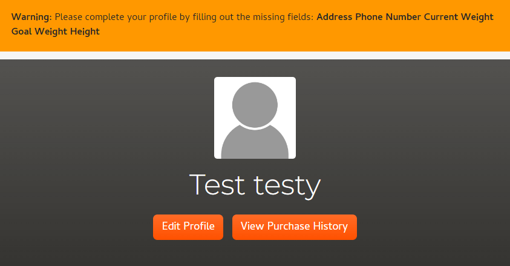 |
| | This section should display the user's email address, address, gender, date of birth, and phone number. Missing fields should be empty and flagged if required. | Reviewed the personal information section on the profile page. | The section displayed the user's email address, gender, and date of birth correctly, but the address and phone number fields were empty, indicating missing information. | Test concluded and passed, but missing fields need to be updated by the user as indicated by the warning message. | 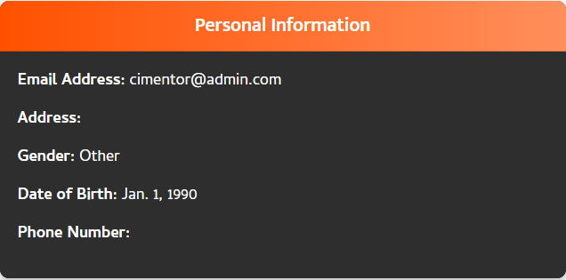 |
| | This section should display the user's current weight, height, and goal weight. If any fields are missing, they should be shown as "None" and flagged for completion if required. | Reviewed the physical measurements section on the profile page. | The section displayed "None" for all fields (current weight, height, and goal weight), indicating missing information. | Test concluded and passed, but the user needs to update these fields as prompted by the profile completion warning. | 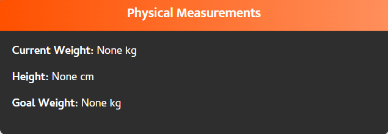 |
| | This section should visually display the user's weight progress over time using a graph. It should update with each new weight log entry. | Reviewed the weight progress tracker on the profile page. | The graph appeared but was empty, with no data points plotted, indicating that no weight entries have been logged yet. | Test concluded and passed, but the user needs to add weight logs for data to display correctly on the graph. | 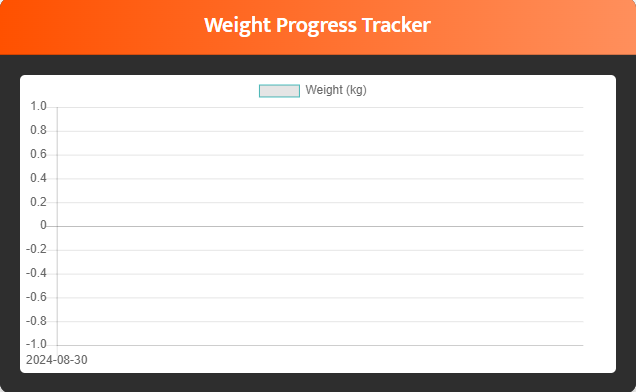 |
| | This section should allow users to view and add entries to their weight log, showing date and weight (kg) with actions. | Reviewed the weight log history on the profile page. | The "Add Weight Log" button was visible but disabled, indicating that action cannot be taken without fulfilling prerequisites. | Test concluded and passed, but requires user input for current weight or goal weight to enable. | 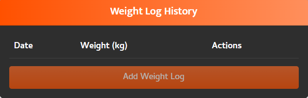 |
| | If the "Add Weight Log" button is disabled, a tooltip should clearly explain the reason, guiding the user to resolve missing information. | Hovered over the disabled "Add Weight Log" button. | The tooltip appeared correctly, stating that the button is disabled because either the current weight or goal weight is missing from the user's profile. | Test concluded and passed. Tooltip effectively communicates required actions to the user. | 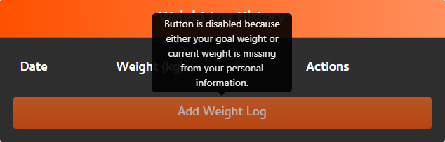 |
| | When a user attempts to delete a weight log entry, a confirmation modal should appear, asking if they are sure they want to delete the entry, with "Cancel" and "Delete" options. | Attempted to delete a weight log entry. | The confirmation modal appeared correctly with options to "Cancel" or "Delete," allowing the user to confirm or abort the action. | Test concluded and passed. |  |
| | The "Edit Weight Log" form should allow users to update their logged weight entry, with options to "Save Changes" or "Cancel." | Accessed the edit option for a weight log entry. | The edit form displayed the current weight value, allowing the user to modify it and save changes or cancel the action. | Test concluded and passed. |  |
| | The "Upload Progress Picture" section should allow users to select a file and upload their progress pictures. The "Upload Picture" button should be enabled if all prerequisites are met. | Reviewed the upload section without any restrictions. | The file chooser and "Upload Picture" button were visible, but the button was disabled, indicating prerequisites were not fulfilled. | Test concluded and passed; user must fulfill prerequisites (current weight and goal weight) to enable upload. | 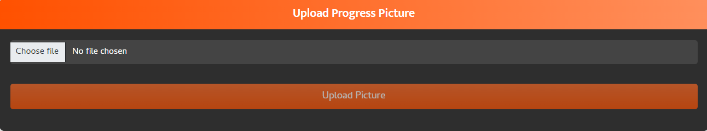 |
| | If the "Upload Picture" button is disabled, a tooltip should explain the reason, guiding the user to resolve missing information from their profile. | Hovered over the disabled "Upload Picture" button. | The tooltip appeared correctly, stating that the button is disabled because either the current weight or goal weight is missing from the user's profile. | Test concluded and passed. | 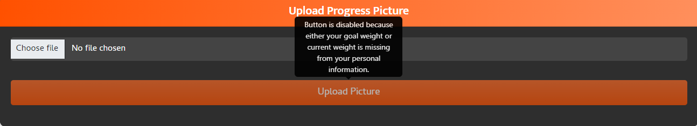 |
| | The "Upload Progress Picture" section should allow users to upload progress pictures, display the uploaded image with a timestamp, and provide an option to delete the image. | Uploaded a progress picture. | The section displayed the uploaded picture correctly with the upload timestamp. A delete icon appeared on the image, allowing users to remove it if desired. | Test concluded and passed. |  |
| | The "Update Personal Information" form should allow users to update their profile details, including an image, email, phone number, address, date of birth, current weight, height, and goal weight. The form should have "Save" and "Delete Account" buttons. | Tested updating various fields in the personal information form. | The form displayed all fields correctly, allowing the user to input or change data. The "Save" button was enabled, and the "Delete Account" button was visible. | Test concluded and passed. | 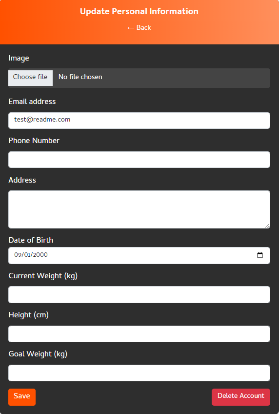 |
| | When a user attempts to delete their account, a confirmation modal should appear, warning that the action cannot be reversed, with "Cancel" and "Delete" options. | Attempted to delete the account. | The confirmation modal appeared correctly with a clear warning message, allowing the user to confirm or cancel the deletion. | Test concluded and failed initially, there was something missing from the javascript code which I added. |  |
| | The "View Purchase History" button on the profile overview should navigate the user directly to the "Order History" page, allowing them to review their purchases. | Clicked on the "View Purchase History" button from the profile overview. | The "View Purchase History" button successfully navigated to the "Order History" page as expected. The back navigation also functioned correctly, returning to the profile page. | Test concluded and passed. |  |
| | The "Order History" section should display a list of all training plans purchased by the user, including the training plan name and date of purchase. A "Back" button should be available to navigate back to the profile page. | Reviewed the order history. | The order history displayed correctly, showing the training plan purchased and the exact date and time of purchase. The "Back" option was available and functioned correctly. | Test concluded and passed. |  |

## Automated Testing

I have conducted a series of automated tests on my application.

I fully acknowledge and understand that, in a real-world scenario, an extensive set of additional tests would be more comprehensive.

### Python (Unit Testing)
I have used Django's built-in unit testing framework to test the application functionality.

In order to run the tests, I ran the following command in the terminal each time:

`python manage.py test`

To create the coverage report, I would then run the following commands:

`coverage run manage.py test`

`coverage report`

To see the HTML version of the reports, and find out whether some pieces of code were missing, I ran the following commands:

`coverage html`

`python -m http.server`

Below are the results from the various apps on my application that I've tested:
| App | File | Coverage | Screenshot                                                                                   | 
| --- | --- | --- |----------------------------------------------------------------------------------------------| 
| about | test_urls.py | 100% |  | 
| about  | test_views.py | 100% |   |
| accounts | test_models.py | 100% |  | 
| accounts  | test_forms.py | 98% |   |
| accounts | test_views.py | 71% |   |
| accounts | test_urls.py | 100% |   |
| checkout | test_models.py | 100% |   |
| checkout | test_forms.py | 100% |   |
| checkout | test_views.py | 90% |   |
| checkout | test_urls.py | 100% |   |
| contact | test_models.py | 100% |   |
| contact | test_forms.py | 100% |   |
| contact | test_views.py | 100% |   |
| contact | test_urls.py | 100% |   |
| faq | test_views.py | 100% |   |
| faq | test_urls.py | 100% |   |
| home | test_models.py | 100% |   |
| home | test_forms.py | 100% |   |
| home | test_views.py | 100% |   |
| home | test_urls.py | 100% |   |
| plans | test_models.py | 88% |   |
| plans | test_views.py | 44% |   |
| plans | test_urls.py | 100% |   |

## JavaScript (Jest Testing)
During the implementation of unit testing using Jest, I encountered several challenges, primarily due to extensive DOM manipulation by third-party libraries such as Chart.js and Stripe. Mocking Chart.js proved particularly challenging, leading to multiple obstacles that prevented precise testing. As a result, I had to resort to more generalized assertions to verify that data was correctly loaded into the chart.

Stubbing Stripe was another complex task that presented significant difficulties, and as a result, I was unable to fully unit test the associated script. Additionally, several other third-party services required mocking, which was handled with the help of jest.setup.js.

To run the tests, it is necessary to execute the command npm install to install all the required packages needed for compiling and running the tests. Tests can then be executed using the command npm test, and to obtain coverage reports, the command npm test --coverage should be used.

Below are the coverage results and successful test runs generated during the testing process:

| Test Suites | Tests | Screenshot                                                      |
| --- | --- |-----------------------------------------------------------------|
| 3 passed | 9 passed |  |

## User Story Testing

| User Story | Screenshot |
| --- | --- |
| As a **new user**, I want to **be able to create a new account with my personal information**, so that I **can start tracking my weight and physical measurements.** |  |
| As a **new user**, I want to **read success stories and testimonials** so that **I can trust the effectiveness of the coaching services.** |  |
| As a **new user**, I want to **be able to message the coach with any queries I have before purchasing a plan**, so that I **can make an informed decision.** |  |
| As a **new user**, I want to **be able to access a comprehensive FAQ section**, so that I **can quickly find answers to common questions about the platform and its services without needing to contact support.** |  |
| As a **registered user**, I want to **update my profile information**, so that my **information remains accurate and relevant.** |  |
| As a **registered user**, I want to **securely pay for my selected training package using Stripe**, so that I can **access my plans and coaching services.** |  |
| As a **registered user**, I want to **contact my coach for support** so that I **can get help when I need it.** |  |
| As a **registered user**, I want to **be able to reset my password if I forget it**, so that I **can regain access to my account securely.** |  |
| As a **registered user**, I want to **receive a confirmation message after successfully purchasing a training plan**, so that I **know my payment was processed and I have access to the purchased plan.** | 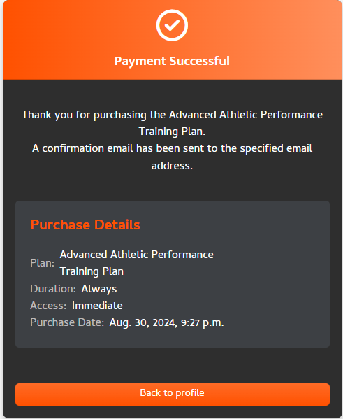 |
| As a **registered user**, I want to **be able to view my order history**, so that I **can keep track of the training plans or products I have purchased.** |  |
| As a **registered user**, I want to **be able to see which training plans I have already purchased**, so that I **don’t accidentally buy the same plan again.** |  |
| As a **registered user**, I want to **be able to view my weight progress on a graph**, so that I **can easily visualize my weight changes over time and assess my progress toward my goals.** |  |
| As a **registered user**, I want to **delete a progress image**, so that I **can remove pictures that I no longer want to keep or that were uploaded by mistake.** |  |
| As a **registered user**, I want to **see all my uploaded progress images**, so that I **can compare my current and past progress visually.** |  |
| As a **registered user**, I want to **view and purchase training plans** so that I **can select the plan that best fits my needs.** |  |
| As a **registered user**, I want to **delete a weight log entry**, so that I **can remove any incorrect or unwanted entries from my history.** |  |
| As a **new or registered user**, I want to **be able to subscribe to the newsletter**, so that I **can receive monthly updates about the latest news in the fitness world.** |  |
| As a **registered user**, I want to **edit an existing weight log entry**, so that I **can correct any mistakes or update my records if my weight changes.** |  |
| As a **registered user**, I want to **view my profile information and progress**, so that I **can monitor my weight changes and keep track of my goals.** | 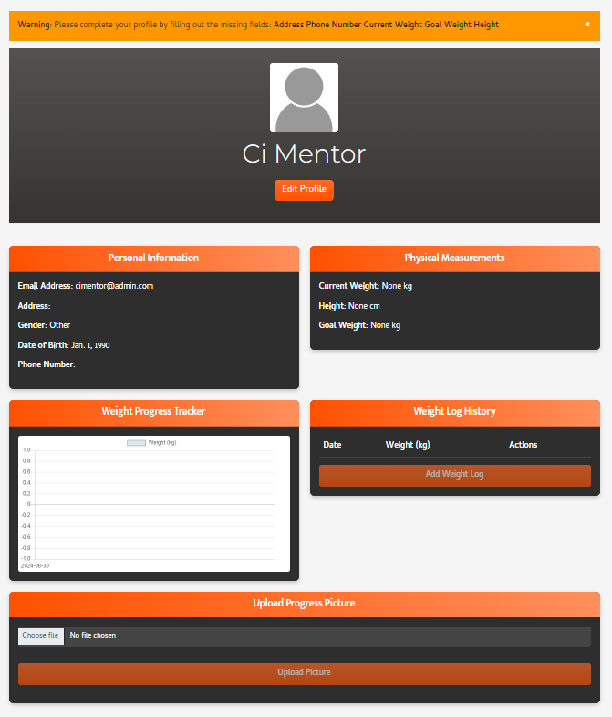 |
| As a **registered user**, I want to **see a list of all my weight logs**, so that I **can review my progress and make adjustments as needed.** |  |
| As a **registered user**, I want to **be able to add a new weight log entry**, so that **I can track my progress over time.** |  |
| As a **registered user**, I want to **delete my profile**, so that **my personal information is no longer stored in the system.** |  |
| As an **admin**, I want to **create, manage and update plans** so that **users can see the up-to-date plans and services at the current time** |  |
| As an **admin**, I want to **view and manage payments** so that **I can keep track of subscription fees and payment statuses.** |  |
| As an **admin**, I want to **view and manage the list of newsletter subscribers**, so that I **can effectively communicate with users and ensure the newsletter reaches the intended audience.** |  |

## Bugs

> [!NOTE]  
> There are no remaining bugs that I am aware of.